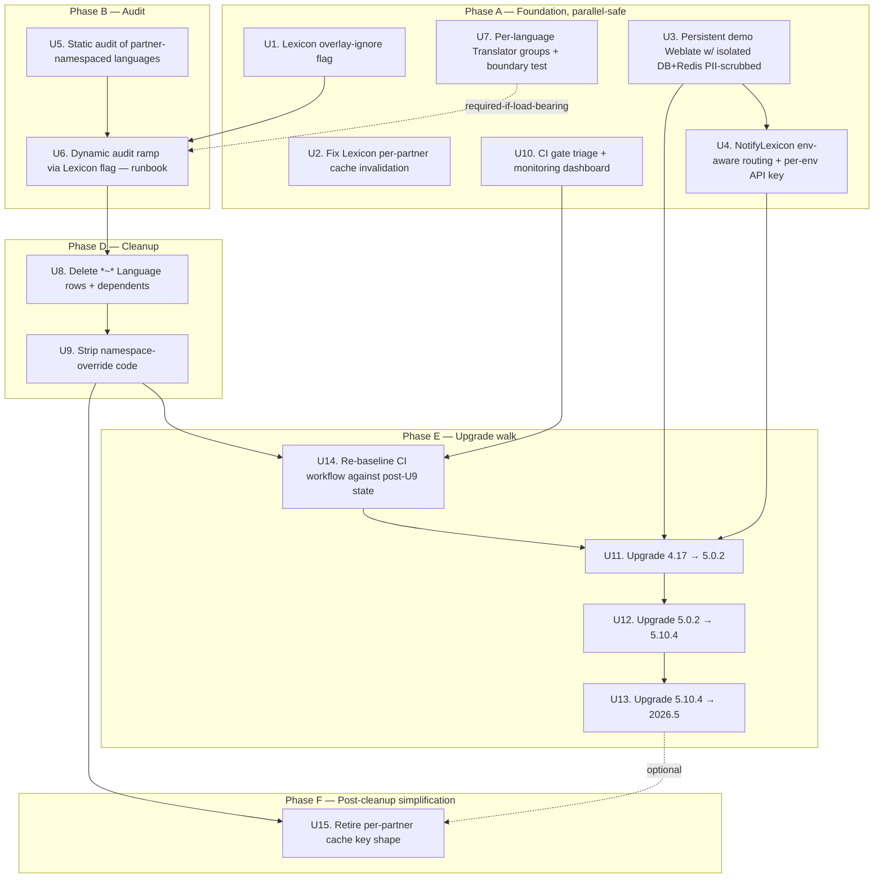

# Weblate Modernization — Override Removal, Demo Mirror, and 4.17 → 2026.5 Upgrade Walk

## Summary

Walks the brainstorm's rigid cutover order across 15 implementation units in three repos (`weblate` primary, `lexicon` for the overlay-ignore flag + cache fix + post-cleanup retirement, `vendasta/gitops` for deployment manifests): introduce a Lexicon overlay-ignore flag (with `partnerID=""` early-normalization so ignored partners share the base cache key) and close the pre-existing per-partner cache invalidation bug (with explicit race-closing ordering, atomicity, and InvalidateCache symmetry), stand up a true demo Weblate mirror with isolated PII-scrubbed DB and single-writer-per-env `NotifyLexicon` routing with per-env API keys, audit and convert partners to a Weblate-admin-managed language-collaborator model (with automated AE2 boundary test), delete partner-namespaced data with mechanical CSV-gated transaction-atomic batched deletion across 10+ cascade tables and dated archive side tables, strip the fork's namespace-override code with fail-closed `set_permissions` refactor, then walk the three mandatory upgrade hops (4.17 → 5.0.2 → 5.10.4 → 2026.5) using a multi-surface rollback bundle and per-hop sized maintenance windows. Optional post-cleanup unit retires the now-dead per-partner cache key shape.

---

## Problem Frame

The Vendasta Weblate fork (currently 4.17 on Python 3.11) carries a partner-namespace override system that has compounded upgrade debt and operational complexity, while Lexicon's downstream contract exposes `partner_id` overlay routing that almost nobody actually relies on (`PartnerCustomizationBlacklist = ["VMF"]` already proves one partner was hard-coded out for being more painful than valuable). The fork is three Weblate-mandated hops behind current; each hop will require surgery on `SOCIAL_AUTH_PIPELINE` rewrites (5.0.2, 5.7), an addon-event-handler signature change (5.14), and a Python 3.12 bump (5.15). Past upgrade attempts failed because the namespace-override code intersects with exactly the upstream surfaces that churn most across majors. See origin doc for the full pain narrative.

---

## Requirements

- R1. Persistent Weblate demo instance exists, mirrors prod config (auth, addons, integrations), and is the target of Lexicon's `demo` env. *(origin R1)*
- R2. Demo loadable on demand with a recent prod snapshot so each upgrade hop is validated against realistic content. *(origin R2)*
- R3. Lexicon supports a per-partner overlay-ignore flag, ramped via configuration following the existing `PartnerCustomizationBlacklist` shape. *(origin R3)*
- R4. When the flag is set for partner P, `GetTranslation`/`GetTranslations` returns base language only; cache keys are recomputed so no stale overlay can be served. *(origin R4)*
- R5. Flag flip is instant rollback (config change + redeploy, not a data restore). *(origin R5)*
- R6. Weblate-managed group exists per shared language, scoped to that language and carrying the Translate role. *(origin R6)*
- R7. Collaborator group membership managed inside Weblate by an admin — no IAM/SSO change, `set_permissions` flow unchanged for this concept. *(origin R7)*
- R8. Edits by nominated collaborators apply globally to the shared language. *(origin R8)*
- R9. After dynamic audit confirms partners are clean, all `*~*` language rows and dependent components are deleted. *(origin R9)*
- R10. `weblate/vendasta/` namespace-override code removed (views, namespace constants, namespace-group creation, partner-tier check) along with all upstream-file patches that depended on it. *(origin R10, scope-widened per Phase 1 research)*
- R11. `NotifyLexicon` and `ApplyTranslationsFromHistory` addons preserved. *(origin R11)*
- R12. Upgrade follows Weblate's documented three mandatory stops: 4.17 → 5.0.2 → 5.10.4 → 2026.5. *(origin R12, refined to upstream's actual policy of intermediate stops rather than per-minor walk)*
- R13. Each hop validated in demo with the F3 smoke-test surface (SSO, save+webhook+serve roundtrip) before promotion to prod. *(origin R13)*
- R14. Python runtime upgraded only as required by a given Weblate release. *(origin R14 — 5.15 forces 3.11 → 3.12)*
- R15. `partner_id` remains required on Lexicon's `GetTranslation`/`GetTranslations`/`InvalidateCache`. *(origin R15)* **Authoritative correction from Phase 1 research:** today, only `InvalidateCache` actually enforces auth via `AccessPartnerMarket`. `GetTranslation`/`GetTranslations` accept any `partner_id` without authorization. Whether to close that gap is captured as an Open Question that must be resolved before U6 begins — silently shipping the plan as written would propagate a false security claim from the brainstorm.
- R16. No coordinated SDK upgrade required across consuming microservices. *(origin R16)*
- R17. *(plan-added)* `NotifyLexicon` is env-aware, so demo Weblate notifies only demo Lexicon. The current hardcoded fan-out to both envs is replaced with environment-driven routing.
- R18. *(plan-added)* The pre-existing Lexicon per-partner cache invalidation bug is fixed: `UpsertTranslation` invalidates all partner-variant cache keys for the affected (component, language), not only the base key. This is the technical work that makes R4 ("no stale overlay") honest.

**Origin actors:** A1 (Vendasta developer/admin), A2 (Partner), A3 (Nominated language collaborator), A4 (Lexicon SDK caller / microservice)
**Origin flows:** F1 (Dynamic audit ramp via Lexicon overlay-ignore flag), F2 (Partner converts from override to nominated collaborator), F3 (No-skip Weblate version upgrade hop)
**Origin acceptance examples:** AE1 (covers R3/R4/R5 — flag flip behavior + cache recompute), AE2 (covers R8 — collaborator edits visible globally), AE3 (covers R12/R13 — no-skip rejection + rollback exercise), AE4 (covers R15 — partner_id stays required after override removal)

---

## Scope Boundaries

- Lexicon SDK signature changes in Go, Python, TypeScript — `partner_id` stays required and unchanged. *(origin)*
- Coordinated migration of every downstream microservice that passes `partner_id`. *(origin)*
- Deprecating or rewriting Lexicon. *(origin)*
- New translation review/approval tooling beyond what Weblate ships natively. *(origin)*
- A v2 multi-tenant translation isolation system. *(origin)*
- Backporting Vendasta fork patches upstream to weblate.org. *(origin)*
- Changes to the `ApplyTranslationsFromHistory` addon's behavior, SSO/IAM integration shape, or Weblate's translation file formats. *(origin)*
- Brand-preserving "soft override" mechanisms — explicit anti-goal. *(origin)*
- Dynamic feature-flag infrastructure for Lexicon (config service, GrowthBook integration). The overlay-ignore flag uses the existing static-list pattern; if dynamic config is wanted later, that is a separate effort.
- Backfilling test coverage for the surviving Vendasta integration code (`NotifyLexicon`, `ApplyTranslationsFromHistory`, `VendastaOpenIdConnect`). Pre-existing condition; the new env-aware routing in `NotifyLexicon` is the only one given test coverage.

### Deferred to Follow-Up Work

- **Establishing `docs/solutions/` in this repo and capturing the upgrade discipline + override-removal procedure as institutional learnings** — strong candidate for `/ce-compound` capture after the work lands; surfaces in learnings researcher's recommendation.
- **VSRE-1450 Redis IP migration follow-on work** — orthogonal; verify current state before touching `microservice.yaml` but do not redesign.
- **Migrating from `microservice.yaml`-style deployment to whatever `vendasta/gitops` uses canonically** — confirm authoritative source as a U3 sub-task; do not redesign the deploy pipeline as part of this plan.
- **Stale `pyproject.toml` and `README.md` Python 3.7 metadata cleanup** — rolled into U13 as a single line item, not a dedicated unit.
- **Pulling the Confluence post "That time that I broke Weblate" into a checked-in postmortem doc** — recommended by learnings research; not blocking.

---

## Context & Research

### Relevant Code and Patterns

**Weblate fork (`/Users/jesseredl/source/weblate`):**
- `weblate/vendasta/{constants,access,addons,scripts,views,auth,aa_sdk}.py` — full Vendasta customization footprint (~458 LOC, zero tests).
- Upstream attachment surface (must come out with the namespace system): `weblate/urls.py:47,1130-1135`; `weblate/settings_docker.py:517,556,1141-1142`; `weblate/lang/models.py:37,135-137,630`; `weblate/lang/views.py:34-52`; `weblate/trans/forms.py:82,1086,1119-1135`; `weblate/trans/views/basic.py:56,152-351` (largest single touchpoint); `weblate/trans/views/edit.py:642-690`; `weblate/auth/models.py:52,485-492`; `weblate/templates/{component,translate,new-namespaced-language}.html`.
- Deploy surface: `mscli-Dockerfile`, `microservice.yaml`, `deploy_demo.json`, `deploy_prod.json`, `cloudbuild.yaml`. Authoritative source is `vendasta/gitops` per README — `microservice.yaml` may be drift.
- Lint: `inv lint` (`tasks.py`) = `black .` + `pre-commit run flake8 --all`. Pre-commit config is stale (`py37` target while runtime is 3.11).
- CI: upstream Weblate workflows present in `.github/workflows/` but not gating PRs on the fork — Mission Control just builds and ships.

**Lexicon (`/Users/jesseredl/source/lexicon`):**
- `internal/translation/service/service.go:22` — `PartnerCustomizationBlacklist = []string{"VMF"}` — canonical pattern for the new overlay-ignore flag.
- `internal/translation/service/service.go:53,70-73,134-137,162` — cache key construction and TTL (3600s).
- `internal/translation/service/service.go:54` — `UpsertTranslation` invalidates only `lexicon-{component}-{lang}`, missing per-partner variants. This is R18.
- `internal/translation/service/service_test.go` — table-driven testify + hand-rolled mocks; right home for new tests.
- `internal/api/{servers.go,http.go}` — gRPC + HTTP entry points exposing `partner_id`.
- No feature-flag system in Lexicon today — env vars + package-level vars only.

### Institutional Learnings

None present — `docs/solutions/` does not exist in either repo. The Confluence post "That time that I broke Weblate" is referenced in the brainstorm but is not checked into either repo. See "Deferred to Follow-Up Work" for capture suggestion post-landing.

### External References

- Weblate official upgrade guide: https://docs.weblate.org/en/latest/admin/upgrade.html
- Weblate 5.x change history: https://docs.weblate.org/en/latest/changes/v5.html
- Weblate 2026.5 changelog: https://docs.weblate.org/en/latest/changes.html
- Three mandatory intermediate stops: **4.17 → 5.0.2 → 5.10.4 → 2026.5**. Per-minor walk is not required, but each hop accumulates multiple breaking changes that this plan addresses by hop-targeted unit.

---

## Key Technical Decisions

- **Lexicon overlay-ignore flag uses the static-slice pattern (`var OverlayIgnoreList = []string{...}`) — not a new dynamic-config system.** Rationale: mirrors the existing `PartnerCustomizationBlacklist` shape; consistent with current Lexicon conventions; ramping = code change + redeploy per partner (acceptable for a once-per-soak-window operation that's intentionally slow). Adding GrowthBook or a config service is its own effort and not justified by this work alone.
- **`OverlayIgnoreList` membership normalizes `partnerID = ""` at the same call site as `PartnerCustomizationBlacklist`** (`internal/translation/service/service.go:85-87, 126-128`). Rationale: once a partner is on the ignore list, its `GetTranslation` response is byte-equivalent to the base response — keeping `partner_id` in the cache key creates duplicate-payload entries that exist only to be invalidated. Reusing the existing early-normalize pattern means ignored partners share the base cache key and require zero per-partner invalidation. This collapses U1 to a one-line addition and shrinks U2's invalidation surface to only the still-overlaid partner set.
- **Fix the Lexicon per-partner cache invalidation bug as part of this plan, in a dedicated unit (U2) alongside the new flag (U1).** Rationale: R4 demands "no stale overlay can be served"; without fixing the bug, flag rollback is up to 1h delayed (TTL soak). With the early-normalize decision above, the invalidation surface shrinks monotonically through U6 — by U9 it covers zero partners and can be retired (U15).
- **U2 ordering invariant: invalidate-before-write + second-invalidate-after-write.** Rationale: today's `UpsertTranslation` writes vstore first then deletes the base cache key, leaving a race where a concurrent read can re-populate the cache from stale vstore between the read-miss and the SetEX. Closing this requires pre-invalidating the cache, doing the vstore write, then invalidating a second time to catch any reader that filled the cache mid-write. Treats the race as primary correctness, not a U2 implementation footnote.
- **U2 atomicity guarantee for per-partner key fan-out: Lua-scripted multi-key delete, or accept best-effort within TTL.** Rationale: today's Redis client exposes only single-key `Delete`. A naive SCAN+DEL gives N independent round-trips with partial-failure risk — R5's "instant rollback" promise needs either an atomic primitive (Lua `EVAL`) or an explicit qualifier ("instant under normal Redis health; up to 1h under partial failure"). Decision deferred to U2 implementation after measuring per-partner key count; default toward Lua-scripted atomic if SCAN+DEL would routinely return >1 key.
- **`NotifyLexicon` env-aware routing defaults to single-writer-per-env** (`WEBLATE_LEXICON_TARGETS=prod` for prod Weblate, `=demo` for demo). Rationale: dual-target fan-out makes demo a shared write target that prod Weblate stomps mid-upgrade, breaking demo's role as the upgrade canary (R1, R2, F3). Demo Lexicon content freshness, if wanted, comes from a snapshot pipeline that mirrors U3's demo-Postgres restore — not from continuous cross-env writes. Original brainstorm scoping kept `prod,demo` for backward compat; deepening surfaced the bug. (This *changes* U4 from the v1 plan; original Open Question on this is now resolved.)
- **U4 also rotates `WEBLATE_ADMIN_API_TOKEN` to per-env distinct values before U11 begins.** Rationale: today's symmetric API key means a misrouted Weblate (demo-tagged pod accidentally running with prod config or vice versa) can write to either Lexicon. Per-env keys make the env separation enforced, not just policy.
- **No characterization tests for `weblate/vendasta/` namespace code before deletion.** Rationale: the code is going away; transient tests add noise. Cleanup unit (U9) relies on manual demo validation via the F3 smoke-test surface. Trade-off explicitly accepted. Counter-balancing this: U7's per-language Group is given an automated boundary test (a deepening addition — Group misconfiguration has no comparable "going away" justification).
- **Re-enable upstream Weblate's `test.yml` workflow on the fork, split across two units (U10 triage + U14 re-baseline).** Rationale: the triage portion (which upstream tests touch removed code, which need mocks for SSO/IAM, which lack infrastructure) does not depend on U9 — it depends on *knowing what U9 will remove*, which U5 already produces. Splitting lets the triage work absorb U6's multi-week slack rather than sitting idle. U10 starts in Phase A/B; U14 runs after U9 and gates U11.
- **U8 wraps per-Language deletion in `transaction.atomic()`** with a `--max-languages-per-run` checkpoint flag. Rationale: U8 will trigger writes across at least 9 cascade tables (Language, Plural, Translation, Unit, Change, Memory, FontOverride, Announcement, Group.languages M2M, Profile.languages M2M, Component.source_language, Glossary.source_language). Without atomic wrapping, mid-run interruption leaves orphans the snapshot rollback can't surgically undo. Per-Language atomicity keeps blast radius small and makes the script re-runnable after interruption.
- **U8 dry-run uses `transaction.atomic()` + `transaction.set_rollback(True)`, NOT `Collector.collect()`-only.** Rationale: a Collector-only dry-run misses `post_delete` signals, custom `Model.delete()` overrides, and DB triggers — exactly the surfaces this fork modifies (Change-model audit chain, stats recomputes). The trustworthy dry-run executes real cascade SQL inside a rolled-back transaction and reports the actual `(count, per_model_dict)` plus per-table wall-clock time.
- **U8 archives deleted rows to dated side tables (`lang_language_archived_{run_id}`, `trans_translation_archived_{run_id}`, etc.) within the same transaction as the delete.** Rationale: not soft-delete (production tables are clean) but row-level recovery if a partner reports breakage post-cutover. Avoids the full-snapshot-restore-loses-all-recent-work failure mode where rollback erases unrelated translator work between snapshot and incident detection. Retention 90 days; documented cleanup procedure.
- **U8 acknowledges `Change.language` is `on_delete=CASCADE`; history is NOT preserved as the original brainstorm assumed.** Rationale: Phase 1 audit showed `weblate/trans/models/change.py:484-486` cascades Change rows on Language deletion. Two paths: (a) accept the audit-history loss for namespaced-language Change rows (no current compliance/forensics use case), or (b) add a pre-delete step that NULLs `Change.language_id` and denormalizes the language code into `Change.details` JSON. Defaulting to (a) with explicit acknowledgment; if compliance owner pushes back during U8 review, switch to (b).
- **Per-language collaborator groups created programmatically with idempotent script + automated AE2 boundary test.** Rationale: one Group per language gives admins surgical control; idempotent script survives re-runs. The boundary test (a "FR Collaborators" member attempting to PATCH a Spanish unit returns 403) runs in U10's CI gate and on every upgrade hop — without it, U7 satisfaction would degrade to "the script ran" rather than "the access boundary holds," and a silent `Group.languages` M2M write failure would over-privilege every collaborator instantly.
- **U9 `set_permissions` simplification fails closed.** Rationale: collapsing the `if developer / elif partner / else public` decision tree risks a "drop the else" refactor that grants every authenticated user developer access. The simplification must (a) explicitly test every `roles` claim shape IAM emits today, (b) default empty/unknown `roles` to the LEAST-privileged surviving group (or fail closed with no group assignment), (c) sequence obsolete-Group deletion strictly AFTER the code deploy completes — never simultaneously, never before.
- **Hard-delete `*~*` Language rows (not soft-delete).** Rationale: these are going away forever; the override mechanism is being removed entirely. Soft-delete preserves data that nothing should ever read again. Archive side tables (above) give the same recovery surface without the soft-delete cost.
- **Three upgrade units (U11, U12, U13), one per mandatory hop**, each with its own validation and rollback gate. Rationale: per upstream's no-skip discipline, hops are atomic from a migration standpoint; from a planning standpoint, each carries distinct breaking-change risk (SOCIAL_AUTH_PIPELINE rewrite at hop 1 and hop 2, NotifyLexicon signature break and Python 3.12 bump at hop 3) and warrants its own implementation unit. Demo-then-prod is execution discipline *inside* each unit, not a unit boundary.
- **Cleanup unit (U9) runs BEFORE the upgrade walk, not after.** Rationale: the namespace code is precisely what makes upgrades hard; carrying it through three hops re-introduces the problem we're solving. The upgrade hops do not need to address vendor patches in `urls.py`/`settings_docker.py`/`lang/`/`trans/`/`auth/` because those patches are gone by U11.
- **Rollback bundle for upgrade hops is multi-surface, not snapshot-only.** Rationale: image revert + Postgres snapshot restore alone leaves Weblate Redis (sessions + cache fragments referencing migrated rows), Lexicon Redis (per-(component, lang[, partner]) TTL-bounded staleness), in-flight `NotifyLexicon` webhooks, and post-upgrade SSO sessions out of sync. The rollback procedure executes all five in order: image → Postgres → Weblate Redis flush → Lexicon Redis invalidation (full flush for U13 given signature-change scope; targeted for U11/U12) → SSO session invalidation.
- **Per-hop hard-down maintenance window estimates: U11 90–120 min, U12 60–90 min, U13 2–3 hours.** Rationale: the original "30-60 min per hop" framing in v1 understated U11 (largest schema migration of the three) and U13 (Python runtime swap + granian server change + addon signature change). Revised estimates feed customer-facing comms plan.

---

## Open Questions

### Resolve Before Implementation

- **[Affects R15, AE4, U1, U6][Product]** Lexicon's `GetTranslation`/`GetTranslations` read path does NOT authenticate `partner_id`; only `InvalidateCache` calls `AccessPartnerMarket`. R15 and AE4 in the origin assert auth that doesn't exist on the read path. **Three resolution options:** (a) close the gap — add `AccessPartnerMarket` call to read-path RPC entry points AND `GetTranslationsHTTP` (scope expansion, new sub-unit); (b) retract R15/AE4's auth framing — `partner_id` is required for shape only, not authenticated on reads; explicitly accept residual risk; (c) re-route to `/ce-brainstorm` if this is a genuine product-level scope change beyond a documentation correction. Must resolve before U6 begins because the ramp runbook's "safe to delete" classification depends on whether unauthenticated callers can fabricate or suppress signal.
- **[Affects U3, U11, U12, U13][Operational]** `microservice.yaml` vs `vendasta/gitops` source of truth for prod deployment. Originally Deferred; promoted to Resolve Before Implementation because U11's deploy will silently target the wrong manifest if unresolved. Owner: U3 sub-task 4.
- **[Affects U3][Operational]** Demo Postgres topology — `microservice.yaml` shows `weblate-demo` sharing the prod Postgres host (`10.33.49.3`) with DB name `weblate`. Whether logical DBs differ or demo literally uses prod data is unknown; requires SRE confirmation. If shared, U3 includes provisioning a separate DB before any other demo work proceeds.

### Resolved During Planning

- **Cache invalidation strategy for overlay-ignore flag flip** — Resolved via R18 + U2: fix `UpsertTranslation` to invalidate per-partner variants with invalidate-before-write ordering and atomicity guarantee, plus U6 ramp procedure adds explicit Step 0 / Step N cache evict. R5's "instant rollback" qualified as "instant under normal Redis health; up to 1h under partial failure."
- **Number of upgrade hops** — Resolved by Phase 1 framework-docs research: three mandatory stops per upstream policy (4.17 → 5.0.2 → 5.10.4 → 2026.5), not a per-minor walk.
- **Granularity of language-collaborator groups** — Resolved by Phase 1 brainstorm dialogue: one Weblate Group per language (managed in Weblate, not IAM); plus deepening added the automated AE2 boundary test.
- **Whether `partner_id` cache key should normalize to empty for ignored partners** — Resolved via deepening Architecture Finding 1: yes, normalize `partnerID=""` at the same site as `PartnerCustomizationBlacklist` to avoid duplicate-payload entries.
- **`NotifyLexicon` env routing default** — Resolved via deepening Architecture Finding 2: single-writer-per-env (prod Weblate → prod Lexicon only; demo Weblate → demo Lexicon only), NOT the v1 plan's "backward-compatible `prod,demo` default." Cross-env writes break demo canary determinism.
- **U10 dependency on U9** — Resolved via deepening Architecture Finding 3: split into U10 (triage, parallel-safe with U6) and U14 (re-baseline, post-U9, gates U11).
- **U2 vs InvalidateCache symmetry** — Resolved via deepening Data Integrity Finding 7: U2 extends `DeleteCachedTranslation` to behave symmetrically with `UpsertTranslation` (any invalidation evicts base + per-partner variants).
- **Change history preservation under U8** — Resolved via deepening Data Integrity Finding 5: history is NOT preserved (cascade is real); default is accept the loss for `*~*` Change rows; compliance owner pushback would switch to denormalize-before-delete path.

### Deferred to Implementation

- **Lexicon Lua-scripted multi-key delete vs SCAN+DEL** — U2 default is Lua-scripted atomic. SCAN+DEL fallback only if benchmarking shows Lua overhead unacceptable. Decision deferred to U2 implementation after measuring current per-partner key count and benchmarking both paths.
- **`set_permissions` simplification scope after U9** — `Partner Users` and the public-language groups may or may not serve a purpose post-override-removal; U9 either simplifies (keep them) or deletes them based on usage at that point. Whatever path, fail-closed default + per-claim-shape unit test.
- **U8 deployment vehicle nuances** — `kubectl exec` chosen as the default; specific output-tee-to-GCS implementation, `--run-id` collision detection details, and `--max-languages-per-run` checkpoint thresholds settled in U8 implementation.
- **U8 cascade run-time and batch thresholds** — Pre-flight script reads U5 CSV's translation_count to decide batch mode; specific row-count threshold (suggest 10K total / 5K per-language) tuned against demo data.
- **CI matrix for upstream Weblate test suite on the fork** — U10 decides which test files actually need to run; U14 re-baselines after U9.
- **Whether VendastaOpenIdConnect needs an upstream-OIDC rebase per hop** — `social_core` library version compatibility across Weblate 5.x verified in U11 first; if breaks surface, the unit explicitly scopes to OIDC backend repair.
- **[Affects U11][Technical]** Does Lexicon's component path expectation (`{project_slug}/{component_slug}`) survive the 5.0 category URL restructure for projects that use categories? If categories are unused in prod (U5 audit can also confirm), risk is zero; if used, U11 needs a Lexicon-side adjustment outside the unit's scope.
- **[Affects U13][Technical]** Does Lexicon or any other consumer parse Weblate's API error response format? The 5.8 change may break a consumer we haven't identified.
- **[Affects U13][Operational]** Whether the 10-14 day U13 soak is long enough to catch low-activity partner weekly translation-edit cycles. Recommend the upper end (14 days); trade-off is project elapsed time vs detection probability.
- **[Affects rollback for all hops][Technical]** Does any Vendasta service orchestrate translation flows via Temporal? Lexicon uses Temporal for `updatetranslation` workflows per Phase 1 research. In-flight workflow drain/cancel posture during U11/U12/U13 deploy windows is unspecified — verify in U10's monitoring dashboard standup, document drain/cancel posture if relevant.

---

## High-Level Technical Design

> *This illustrates the intended approach and is directional guidance for review, not implementation specification. The implementing agent should treat it as context, not code to reproduce.*

The plan has five phases gated by hard dependencies. The dependency graph keeps Phase A (foundation) parallel-safe; everything else is strictly sequential because each phase produces a precondition the next phase requires.

*(Note: Phase C from the origin brainstorm — the collaborator-model work — was folded into U7 due to its small scope, so phase labels above jump from PhaseB to PhaseD.)*

Key sequencing rationale:
- U1, U2, U3, U7, U10 have no hard dependencies on each other and can run in any order or in parallel (Phase A).
- U4 depends on U3 because env-aware routing has no meaning until a separate demo Weblate exists. **U4 is also a hard prerequisite for U11** — without per-env routing, the U11 demo soak window feeds prod Lexicon.
- U6 is the long pole — depends on U1 (the flag must exist) and U5 (the partner list must exist); itself a multi-week ramp that blocks U8.
- U7 can be done early; only matters to U6 if partners need somewhere to nominate to.
- **U10 splits from the original v1 plan into triage (this Phase A unit) + re-baseline (U14, after U9).** The triage work can absorb U6's multi-week slack rather than sitting idle.
- U14 is the upgrade-gate: re-baselines U10's triage output against the post-U9 simplified fork, then green CI is required before U11.
- **U15 is the post-cleanup simplification**, optionally sequenced after U13 to avoid compounding with major-version risk. Could be Deferred to Follow-Up Work without affecting the upgrade walk.

---

## Implementation Units

### U1. Lexicon overlay-ignore configuration mechanism

**Goal:** Add a per-partner overlay-ignore list to Lexicon so the translation service returns base translations only for listed partners, normalizing `partnerID = ""` at the same call site as `PartnerCustomizationBlacklist` so ignored partners share the base cache key.

**Requirements:** R3, R4, R5, R15

**Dependencies:** None

**Files:**
- Modify: `lexicon/internal/translation/service/service.go`
- Test: `lexicon/internal/translation/service/service_test.go`

**Approach:**
- Add a package-level `OverlayIgnoreList []string` mirroring the existing `PartnerCustomizationBlacklist` shape.
- In `GetTranslation`/`GetTranslations`, extend the existing `vstrings.StringInSlice(partnerID, PartnerCustomizationBlacklist)` check at `:85-87` and `:126-128` to also test `OverlayIgnoreList` and set `partnerID = ""` when matched. The early normalization means ignored partners read/write the base cache key directly — no duplicate-payload per-partner entries, no SCAN+DEL needed for ignored partners.
- Behaviorally identical to the blacklist for the overlay-routing path; difference is intent (audit/ramp vs permanent exclusion) and the explicit operational ramp.
- API surface is unchanged: `partner_id` stays required on `GetTranslation`/`GetTranslations`/`InvalidateCache` per R15. Auth gap on the read path is tracked separately (see Open Questions and Risks).
- Adding/removing a partner = code change + Lexicon redeploy. Acknowledged trade-off; matches existing pattern.

**Patterns to follow:**
- `PartnerCustomizationBlacklist` at `lexicon/internal/translation/service/service.go:22` and its call sites at `:85-87` and `:126-128`.

**Test scenarios:**
- Happy path: partner in `OverlayIgnoreList`, `GetTranslation(component, "fr", "P")` returns base `fr` only with no `fr~P` overlay merged. **Covers AE1.**
- Happy path: partner not in list, `GetTranslation` returns merged base + overlay (existing behavior preserved).
- Edge case: empty `partner_id`, behavior unchanged from today.
- Edge case: partner in BOTH `PartnerCustomizationBlacklist` and `OverlayIgnoreList` — idempotent, same result as either alone.
- Integration: cache key for an overlay-ignored partner equals the base key (no partner suffix), verifying the normalization actually happens — and matches `PartnerCustomizationBlacklist`'s observable behavior today.

**Verification:**
- Existing tests green; new table-driven cases for the flag pass.
- Manual demo: enable for one test partner, hit Lexicon demo, observe base-only response and `redis-cli KEYS lexicon-*-*-{partner}` shows zero new keys for the ignored partner.

---

### U2. Fix Lexicon per-partner cache invalidation on translation updates

**Goal:** Make `UpsertTranslation` invalidate ALL cache keys for the affected (component, language) — including per-partner variants — with explicit ordering and atomicity guarantees so flag flips and source updates do not serve stale overlay data, and so the read-write race in the current code path is closed.

**Requirements:** R4, R18

**Dependencies:** None (logically pairs with U1 but technically independent)

**Files:**
- Modify: `lexicon/internal/translation/service/service.go` (UpsertTranslation; possibly DeleteCachedTranslation for InvalidateCache symmetry — see decision below)
- Modify: `lexicon/internal/redis/redis.go` (add Lua-scripted multi-key delete if atomicity path is chosen; or extend with SCAN helper if accepting best-effort)
- Test: `lexicon/internal/translation/service/service_test.go`

**Approach:**
- Today: `UpsertTranslation` writes vstore at `internal/translation/service/service.go:47-52`, then deletes only `lexicon-{component}-{lang}` at `:53-57`. Two problems compound: (a) per-partner `lexicon-{component}-{lang}-*` variants are never invalidated (R18), and (b) the write-then-delete ordering races with `GetTranslation`'s cache-miss → vstore-read → SetEX path, allowing a concurrent reader to repopulate the cache from stale vstore between the read-miss and the SetEX.
- **Ordering invariant:** invalidate-before-write, do the write, then invalidate a second time. The post-write invalidation catches any reader that won the race and filled the cache mid-write. Both invalidations cover the same key set (base + per-partner variants).
- **Atomicity for multi-key invalidation:** default to a Lua-scripted `EVAL` that deletes a glob-matched key set in one Redis round-trip, returning an explicit success/partial-failure count. Fallback path is SCAN+DEL with per-key error logging — only used if benchmarking shows Lua approach has unacceptable overhead at scale. Either way, no silent-swallow of invalidation failures.
- **R5 "instant rollback" promise:** qualified as "instant under normal Redis health; up to 1h under partial Redis failure." Add runbook step to verify Redis health (no recent partial-failure alerts) before declaring a U6 ramp window started.
- **InvalidateCache symmetry decision:** today's `DeleteCachedTranslation` evicts only the keyed variant — calling with `partnerID=P` does not evict the base key, and calling with `partnerID=""` does not evict per-partner variants. After U6 removes overlay routing for ignored partners, an external `InvalidateCache(component, fr, "PartnerA")` would silently miss the base key those reads actually use. U2 extends `DeleteCachedTranslation` to behave symmetrically with `UpsertTranslation`: any invalidation evicts the base key AND all per-partner variants for that (component, language).
- **Per-partner key shape becomes dead state post-U9** (see U15). U2's invalidation surface shrinks monotonically through U6 and reaches zero by U8 completion.

**Patterns to follow:**
- Existing `DeleteCachedTranslation` at `lexicon/internal/translation/service/service.go:62-75` (single-key delete shape).
- Existing Redis client `Delete` at `lexicon/internal/redis/redis.go:119-128` (single-key DEL round-trip).

**Test scenarios:**
- Happy path: `UpsertTranslation` invalidates the base `lexicon-{component}-{lang}` key (existing behavior preserved).
- Happy path: `UpsertTranslation` invalidates all per-partner variants `lexicon-{component}-{lang}-*` that exist at write time.
- Edge case: no per-partner keys exist for that (component, language) — no error.
- Edge case: hundreds of per-partner keys exist — invalidation completes atomically in one round-trip (Lua path) or within a documented bound (SCAN+DEL fallback).
- Error path: Redis returns partial failure — translation write still succeeds; invalidation error is logged with the affected key prefix and a metric is incremented (alerts feed into the upgrade-window dashboard).
- **Race scenario:** `GetTranslation` fires concurrently with `UpsertTranslation`; mock harness asserts the post-write second-invalidate fires AFTER the racing reader's SetEX, leaving the cache empty rather than holding a stale value. **Specifically asserts the invariant from the U2 ordering decision.**
- Integration: after `UpsertTranslation`, `GetTranslation(component, lang, any_partner)` reads through to vstore (cache miss confirms invalidation across all variants).
- Integration: `InvalidateCache(component, lang, partner)` and `InvalidateCache(component, lang, "")` both produce the same Redis state — no residual stale entries on either side.

**Verification:**
- Tests green; manual runbook with `redis-cli KEYS lexicon-*-*-*` before and after a synthetic upsert shows the per-partner keys gone in a single observation window (no race-visible intermediate state).

---

### U3. Persistent demo Weblate with isolated DB and Redis (PII-scrubbed)

**Goal:** Stand up `weblate-demo` as a true mirror of prod with its own Postgres logical DB and its own Redis instance, restored from a PII-scrubbed prod snapshot. Confirm Lexicon demo env is pointed at this demo Weblate.

**Requirements:** R1, R2 — **with PII scrubbing as a hard precondition, not a runbook detail** (deepening upgrade; promoted from optional)

**Dependencies:** SRE coordination for any DB/Redis provisioning; IAM/SSO coordination for demo-specific redirect URIs

**Files:**
- Modify: `microservice.yaml` (only if confirmed authoritative; otherwise treat as documentation update)
- Modify: `vendasta/gitops` repo — `weblate/demo/deployment.yaml` (target repo)
- Create: `docs/runbooks/demo-snapshot-restore.md` — procedure for taking a prod snapshot, scrubbing PII, restoring into demo

**Approach:**
- Sub-task 1: Confirm with SRE whether existing `weblate-demo` namespace actually has an isolated logical DB or shares the prod `weblate` DB on host `10.33.49.3`. Phase 1 research could not determine this from manifests alone. (Open Question — promote to Resolve Before Implementation, see Open Questions section.)
- Sub-task 2: If demo DB is shared with prod, provision separate logical DB. Restore from a fresh prod snapshot.
- Sub-task 3: Confirm demo Redis is already separate (per VSRE-1450 work — `10.108.124.91` for demo vs `10.180.144.67` for prod in `microservice.yaml`); verify current state before relying.
- Sub-task 4: Confirm `vendasta/gitops weblate/demo/deployment.yaml` is what actually deploys, not `microservice.yaml`. If gitops is canonical, work happens there. **Resolution of this sub-task gates U11 directly** (the upgrade hops cannot ship to the right manifest if the source of truth is ambiguous).
- Sub-task 5: Verify Lexicon demo env already points at this Weblate demo. The routing change (env-aware NotifyLexicon) is U4's job; after U4 lands, this unit's verification re-runs to confirm demo Lexicon is no longer reachable from prod Weblate writes.
- **Sub-task 6 (PII scrubbing — non-negotiable):** the snapshot restore pipeline MUST execute these scrubs before the demo DB is brought online:
  - NULL `social_django_usersocialauth.extra_data` for all rows (removes real OIDC access/refresh tokens for Vendasta employees)
  - NULL `auth_user.auth_token` (Weblate's per-user API tokens)
  - Rewrite `auth_user.email` and other email columns (e.g. `@vendasta.com` → `@demo.invalid`) or scrub entirely
  - TRUNCATE `django_session` (no inherited valid sessions)
  - Confirm IAM/SSO provider has demo-specific allowed redirect URIs separate from prod's (a stolen demo OIDC session cannot redirect to prod)
- **Sub-task 7:** verify demo URL access control — same SSO gating as prod, OR explicitly accept a wider audience (e.g., external partner collaborators during F2 conversations) with corresponding scrub posture.

**Patterns to follow:**
- Existing prod/demo split pattern in `microservice.yaml` (separate `podEnv` per env).

**Test scenarios:**
- Happy path: a translation edit in demo Weblate appears in demo Postgres and does NOT appear in prod Postgres.
- Happy path: snapshot-restore runbook successfully loads a recent prod snapshot into demo DB with all PII scrubs executed (verified by post-restore SQL: `SELECT COUNT(*) FROM social_django_usersocialauth WHERE extra_data IS NOT NULL` returns 0; `SELECT COUNT(*) FROM auth_user WHERE auth_token IS NOT NULL` returns 0; etc.).
- Edge case: demo Redis is bounced — demo Weblate recovers without prod impact.
- Integration: demo Weblate's `NotifyLexicon` webhook reaches demo Lexicon and is served via Lexicon's `GetTranslation` within 30s of commit. **Partially covers F3.**
- Integration: a demo OIDC session, replayed against prod's redirect URI, is rejected by the IAM provider (validates the redirect-URI separation).

**Verification:**
- Demo Weblate accessible at its own URL; writes do not appear in prod DB; runbook validated by performing a scrubbed snapshot restore at least once; SRE confirms separate logical DB; PII scrub queries return zero on the restored demo DB.

---

### U4. NotifyLexicon env-aware routing + per-env API key rotation + URL base injection

**Goal:** Replace `NotifyLexicon`'s hardcoded `for env in ("demo", "prod")` fan-out with single-writer-per-env routing (demo Weblate → demo Lexicon only; prod Weblate → prod Lexicon only). Rotate `WEBLATE_ADMIN_API_TOKEN` to per-env distinct values. Inject Lexicon URL base via env var to remove the topology coupling in the URL template.

**Requirements:** R17

**Dependencies:** U3 (env routing only matters once a separate demo Weblate instance exists). **U4 is a hard prerequisite for U11** — without it, the U11 demo soak window would feed migrated-content to prod Lexicon and break upgrade canary determinism.

**Files:**
- Modify: `weblate/vendasta/addons.py` — replace hardcoded `("demo", "prod")` tuple at `:51`; replace hardcoded `https://lexicon-{env}.apigateway.co/...` URL templates at `:15-22` with env-derived base URLs
- Modify: `weblate/settings_docker.py` — expose `WEBLATE_LEXICON_TARGETS`, `LEXICON_BASE_URL_TEMPLATE` (or per-env equivalents), and per-env `WEBLATE_ADMIN_API_TOKEN` lookup
- Modify: `microservice.yaml` (or gitops equivalent) — set `WEBLATE_LEXICON_TARGETS=demo` for demo, `=prod` for prod; rotate `WEBLATE_ADMIN_API_TOKEN` Secret per env
- Modify: `lexicon` repo's Secret manifests — accept new per-env `WEBLATE_ADMIN_API_TOKEN` values (coordinate with Lexicon team)
- Create: `weblate/vendasta/tests/test_addons.py` — first test file under `weblate/vendasta/`, mocks Lexicon endpoint and asserts correct env routing + URL base + API key per env

**Approach:**
- New env var `WEBLATE_LEXICON_TARGETS` (comma-separated list of Lexicon envs to notify). **Defaults flip from original v1 plan** per Key Technical Decision above: prod Weblate sets `prod`; demo Weblate sets `demo`. Cross-env writes are an explicit anti-goal (breaks demo canary determinism).
- URL base injection: new env var(s) for Lexicon base URL — either `LEXICON_PROD_URL`/`LEXICON_DEMO_URL` or a templated `LEXICON_BASE_URL_TEMPLATE` with `{env}` substitution. Removes the hardcoded `apigateway.co` coupling; Lexicon topology changes (e.g., regional sharding, ingress rename) become config flips, not Weblate code changes.
- Per-env `WEBLATE_ADMIN_API_TOKEN` rotation: today's symmetric key means a misrouted Weblate pod can write to either Lexicon. Per-env keys make the env boundary enforced, not policy. Coordinate rotation with Lexicon team; rotate Lexicon's accepted-keys list before rotating Weblate's emitter.
- Deploy-time assertion: demo Weblate startup logs the resolved `WEBLATE_LEXICON_TARGETS` value, and an alert fires if a prod-tagged Weblate has `demo` in its targets or vice versa.
- Demo Lexicon content freshness: if needed, comes from a separate "snapshot prod-Lexicon into demo-Lexicon" pipeline that mirrors U3's demo-Postgres snapshot pattern — NOT from continuous cross-env writes. Listed in Deferred to Follow-Up Work.

**Patterns to follow:**
- Existing env-var-driven config in `weblate/vendasta/addons.py` (e.g., `WEBLATE_ADMIN_API_TOKEN` at `:106`).

**Test scenarios:**
- Happy path: `WEBLATE_LEXICON_TARGETS=demo`, addon fires on commit, only demo Lexicon endpoint receives the GET, with the demo-env `WEBLATE_ADMIN_API_TOKEN`.
- Happy path: `WEBLATE_LEXICON_TARGETS=prod`, only prod Lexicon endpoint receives the GET with the prod-env key.
- Edge case: `WEBLATE_LEXICON_TARGETS` unset → addon logs a loud warning and refuses to fire (fail-closed; misconfiguration should not silently revert to dual-target).
- Edge case: `WEBLATE_LEXICON_TARGETS=` (empty) → same fail-closed behavior.
- Edge case: `LEXICON_BASE_URL_TEMPLATE` points at a non-existent host → request fails fast with a clear error in logs (no hung threads).
- Error path: one target env's request fails — the other still completes (preserves ThreadPoolExecutor semantics; relevant when migrating partners or during outages).
- Integration: demo Weblate's `WEBLATE_ADMIN_API_TOKEN` is rejected by prod Lexicon (per-env key boundary enforced).

**Verification:**
- New test file passes; demo Weblate commit observed to hit demo Lexicon only via log inspection; prod Lexicon shows zero requests from demo Weblate over a 24h sample window; deploy-time misconfiguration alert verified by intentionally misconfiguring a non-prod environment.

---

### U5. Static audit of partner-namespaced languages

**Goal:** Identify every partner namespace currently in the prod Weblate database with usage stats, producing a CSV that ranks partners by activity for U6's ramp ordering.

**Requirements:** R9 (precondition)

**Dependencies:** None — read-only operation

**Files:**
- Create: `scripts/audit_partner_overrides.py` — Django management command or standalone script
- Create: `docs/audits/YYYY-MM-DD-partner-overrides.csv` — output (created on first run)

**Approach:**
- Query `Language` model for codes matching `*~*` pattern (LIKE `%~%`).
- For each, list components using it (Translation set), last-modified timestamp, total translation count, count of non-empty translations.
- Output CSV columns: `partner_namespace`, `language_code`, `component_count`, `last_translation_change`, `translation_count`, `non_empty_translation_count`.
- Run read-only against prod; commit CSV under `docs/audits/`.
- Bonus: also report any per-namespace `Group` rows that have no users, for awareness during U9 cleanup.

**Patterns to follow:**
- Existing Django shell access referenced in README (`https://weblate.apigateway.co/admin/shell/`) — can run via `manage.py shell` or as a custom management command in `scripts/`.

**Test scenarios:**
- Happy path: script returns one row per `*~*` Language with accurate counts.
- Edge case: no `*~*` Languages exist (empty CSV, exit 0, no error).
- Edge case: a `*~*` Language exists but no Component uses it (still listed; `component_count=0`).
- Integration: run against a small fixture DB with three known namespaced languages, verify output matches expected.

**Verification:**
- CSV committed; team reviews ordering before U6 begins.

---

### U6. Dynamic audit ramp via Lexicon flag — operational runbook

**Goal:** Procedure for ramping U1's overlay-ignore flag partner-by-partner with a defined soak window, monitoring support signal, and classifying every partner as "safe to delete" or "load-bearing override needs conversion."

**Requirements:** R3, R4, R5 (operationalizes them); precondition for R9 cleanup

**Dependencies:** U1 (flag exists), U5 (partner list with ordering)

**Files:**
- Create: `docs/runbooks/lexicon-overlay-ignore-ramp.md`
- Update: `docs/audits/YYYY-MM-DD-partner-overrides.csv` from U5 — add columns `ramp_started`, `ramp_ended`, `classification` (`safe` | `load-bearing` | `pending`)

**Approach:**
- Order partners by U5 CSV: lowest-activity / oldest-modified first (lowest risk first).
- **Per-partner ramp procedure (mandatory steps in order):**
  1. **Step 0 (cache evict pre-flip):** Run `redis-cli --pattern 'lexicon-*-*-{partner}'` (or the U2 Lua script with the partner-glob) to evict the partner's pre-flag overlay entries. Skipping this leaves stale overlay snapshots ready to resurface on rollback.
  2. Add partner to `OverlayIgnoreList`; redeploy Lexicon. Mark `ramp_started` in the audit CSV.
  3. Soak window: 7 days (configurable). Monitor signal: Zendesk tickets tagged with partner_id, Lexicon error logs filtered by partner_id (Datadog), team-internal Slack channel for partner CSMs.
  4. **Audit blind spot:** Lexicon's read path does not authenticate `partner_id` (see Risks and Open Questions). A misconfigured caller passing an empty `partner_id` reads base translations silently, with no partner_id-filtered log line catching it. During ramp windows, enable a temporary log line at `GetTranslation` entry for any request with empty `partner_id`, so unauthenticated calls become visible to the operator.
  5. **Step N (cache evict post-flip rollback path):** if signal triggers rollback, run the same partner-glob cache evict BEFORE removing the partner from `OverlayIgnoreList`. Otherwise the next read repopulates from the existing-but-stale per-partner key, not from current vstore.
- Rollback: cache evict (Step N) → remove partner from `OverlayIgnoreList` → redeploy Lexicon. Document expected timeline (config + deploy is minutes; cache invalidation is instant via U2).
- Success per partner: silent through soak window → mark `safe`. Any signal → mark `load-bearing` and engage F2 (collaborator nomination conversion) before retry.
- Audit completion gate for U8: all partners classified `safe`, OR remaining `load-bearing` partners have completed F2 collaborator nomination and re-ramped silently. **The gate is enforced mechanically by U8's startup check, not human-attested.**

**Patterns to follow:**
- Existing operational patterns in the team (Mission Control deploy flow; per-partner support escalation).

**Test scenarios:**
- *(Test expectation: none — operational runbook, not code. Validation is "the runbook leads to the same outcome when executed by a different operator.")*

**Execution note:** This is a multi-week operational phase that BLOCKS U8. Treat it as a tracked workstream, not a single unit; the gate to U8 is the audit CSV showing every partner classified `safe`.

**Verification:**
- Audit CSV complete; sign-off from operator that no `pending` rows remain.

---

### U7. Per-language Translator groups, admin nomination runbook, automated boundary test

**Goal:** Create one Weblate `Group` per shared language carrying the `Translate` role and scoped to that single `Language`. Document the admin workflow for processing partner collaborator nominations. Add an automated test that asserts the language-scoping boundary so a silent `Group.languages` M2M misconfiguration cannot over-privilege every collaborator.

**Requirements:** R6, R7, R8

**Dependencies:** None (can land early; only matters when partners start being converted via F2)

**Files:**
- Create: `scripts/create_language_collaborator_groups.py` — idempotent Django management command
- Create: `docs/runbooks/nominating-language-collaborator.md` — admin workflow
- Create or extend: `weblate/vendasta/tests/test_collaborator_groups.py` — automated AE2 boundary test (created in U4 if not already; extended here)

**Approach:**
- For each `Language` currently in use that is NOT `*~*`, create or update a `Group` with: `name = "{LANG_CODE} Collaborators"`, `languages = [language]`, `roles = [Translate role]`, `project_selection = SELECTION_ALL`, `internal = False`.
- Idempotent: re-running the script does not create duplicates or modify hand-curated state on existing groups beyond the fields it owns.
- **Fail-loud safety:** the script raises (and exits non-zero) if a newly-created or updated `{LANG_CODE} Collaborators` Group ends up with `Group.languages` empty after the M2M write. An empty `languages` M2M combined with `project_selection=SELECTION_ALL` and `Translate` role grants edit rights across all languages — silently. The script must refuse to leave such a Group in the DB.
- Runbook describes the F2 sequence: receive nomination → confirm nominee has logged in once via SSO (account exists) → admin adds them to the appropriate `{LANG_CODE} Collaborators` Group via Weblate admin UI → confirm back to partner.
- Runbook also flags the admin-UI footgun: editing the wrong Group's `languages` to "fix" something can over-privilege every existing member instantly. Document audit-logging expectations.

**Patterns to follow:**
- Existing `Group` creation pattern in `weblate/vendasta/access.py:46-58` (`get_or_create_namespace_group`) — same `Group.objects.get_or_create` + `roles.add` shape, simpler because no namespace logic.

**Test scenarios:**
- Happy path: script creates one Group per non-namespaced Language with correct role and language assignment.
- Edge case: script re-run, no duplicates, existing Groups untouched in fields the script does not own.
- Edge case: a Language with no current speakers (e.g., a newly-added language with zero translations) still gets a Group.
- Edge case: a forced empty `Group.languages` M2M (simulated mid-script failure) — script detects and raises, leaving no Group in the DB rather than an over-privileged one.
- **Integration / boundary assertion: create a user, add to `"FR Collaborators"`, attempt to PATCH a Spanish unit via Weblate's API → expect 403; PATCH a French unit → expect 200. Covers AE2. This test runs in U10's CI gate AND in U11/U12/U13 hop validation** so a Weblate-version-driven semantics change in `Group.languages` enforcement is caught immediately.

**Verification:**
- Script idempotent across two runs; automated boundary test green in CI; manual UI test by adding a test user to a test language group and observing access restriction.

---

### U8. Delete partner-namespaced Language rows and dependent records

**Goal:** After U6 confirms all partners classified `safe`, hard-delete all `*~*` Language rows and dependent records. Wrap per-Language deletion in `transaction.atomic()`, archive deleted rows to dated side tables for row-level recovery, and gate execution mechanically on the U6 audit CSV state.

**Requirements:** R9

**Dependencies:** U6 (audit must show all partners `safe`); the U6 → U8 gate is enforced by U8's startup check, not human-attested

**Files:**
- Create: `scripts/delete_partner_namespaced_languages.py` — Django management command with `--dry-run`, `--commit`, `--run-id`, and `--max-languages-per-run` flags
- Create: `docs/runbooks/u8-delete-partner-languages.md` — pre-flight queries, deployment vehicle, recovery paths
- Migration: pre-delete schema migration to denormalize `Change.language` code into `Change.details` JSON for `*~*` languages (only if compliance-driven preserve-history path is chosen; see Key Technical Decision)

**Approach:**

- **Mechanical U6→U8 gate at script startup:**
  - Read `docs/audits/{date}-partner-overrides.csv` (U5 output, updated by U6).
  - Refuse to run if any row has `classification != 'safe'`, `ramp_ended IS NULL`, or `ramp_ended` older than the freshness window (default 14 days, configurable).
  - Query `SELECT DISTINCT SUBSTR(code, POSITION('~' IN code) + 1) FROM lang_language WHERE code LIKE '%~%';` and assert the set is a subset of the CSV's `partner_namespace` column. Any DB-side partner namespace absent from the CSV (i.e., added since U5) halts the script.

- **Pre-flight verification (mandatory before `--commit`):**
  - Inventory: `SELECT COUNT(*) FROM lang_language WHERE code LIKE '%~%';` + per-language breakdown.
  - Cascade scope per table — frozen "before" counts captured to `docs/audits/u8-preflight-{run_id}.csv`: `trans_translation`, `trans_unit`, `trans_change`, `weblate_auth_group_languages` M2M, `lang_plural`, `memory_memory` (source + target), `fonts_fontoverride`, `trans_announcement`, `accounts_profile_languages` M2M, `accounts_profile_secondary_languages` M2M.
  - **Safety guard:** `SELECT id, code FROM lang_language WHERE code LIKE '%~%' AND id IN (SELECT source_language_id FROM trans_component);` — non-empty means a `*~*` Language is a Component source_language; deletion would silently nuke entire projects. Script halts on any hit, requires manual investigation. Same probe for `glossary` source_language.
  - Snapshot: capture prod snapshot ID + timestamp into the same audit artifact.

- **Cascade enumeration (all relationships verified against Weblate data model):**
  - `lang_plural.language` → CASCADE delete (`weblate/lang/models.py:793`)
  - `trans_translation.language` → CASCADE delete; cascades further to `trans_unit`
  - `trans_change.language` → **CASCADE delete** (`weblate/trans/models/change.py:484-486`) — history is NOT preserved as the original brainstorm assumed. See Key Technical Decision: default to accept history loss for `*~*` languages; switch to denormalize-before-delete path only on compliance owner pushback.
  - `memory_memory.source_language`/`target_language` → CASCADE delete (potentially PII-bearing user-typed strings)
  - `fonts_fontoverride.language` → CASCADE delete
  - `trans_announcement.language` → CASCADE delete
  - `weblate_auth_group_languages` M2M → row removed; Group preserved (U9 decides Group deletion)
  - `accounts_profile_languages` / `accounts_profile_secondary_languages` M2M → row removed; user preferences lose the `*~*` entry silently (acceptable; user can re-select)
  - `trans_component.source_language` and `glossary.source_language` → CASCADE deletes the entire Component/Glossary. **Pre-flight safety guard above prevents this from firing.**

- **Dry-run semantics: `transaction.atomic()` + `transaction.set_rollback(True)`, NOT `Collector.collect()`-only.** The dry-run executes real cascade SQL inside a rolled-back transaction so post_delete signals, stats recomputes, and DB triggers all fire (and any failures surface before commit). Captures `(count, per_model_dict)` plus per-table wall-clock time. Asserts post-rollback `Language` row count equals pre-rollback count. Output captured to `docs/audits/u8-dryrun-{run_id}.json`.

- **Commit-mode loop:** per-Language deletion wrapped in `transaction.atomic()`. Archive deleted rows to dated side tables (`lang_language_archived_{run_id}`, `trans_translation_archived_{run_id}`, etc.) within the same transaction. Progress logging every N rows or every Language completion. `LOCK TIMEOUT` set so a stalled cascade aborts cleanly rather than blocking concurrent `NotifyLexicon` webhook commits. Interrupted mid-Language → rolled back automatically; script is re-runnable.

- **Sizing & batching:** pre-flight reads U5 CSV's `non_empty_translation_count`. If total Translation rows to cascade exceeds threshold (suggest 10,000 total or `>5000` for any single language), batch mode is mandatory. Execution window: lowest-translator-activity window, operator confirms via Datadog `weblate.translation.commit` rate.

- **Deployment vehicle:** `kubectl exec` into the prod Weblate pod, with output tee'd to a timestamped file uploaded to GCS at script exit. Vehicle requires explicit confirmation of kubectl context (must be GKE prod, not local/demo — known footgun per CLAUDE.md) as first step in the runbook. Script refuses `--commit` mode unless a matching `--run-id` dry-run artifact exists in GCS less than 1 hour old.

- **Post-deletion verification (queries captured to `docs/audits/u8-postrun-{run_id}.csv`):**
  - `SELECT COUNT(*) FROM lang_language WHERE code LIKE '%~%';` returns 0.
  - Orphan probe: `SELECT COUNT(*) FROM trans_translation t LEFT JOIN lang_language l ON t.language_id = l.id WHERE l.id IS NULL;` returns 0.
  - Component source-language probe: `SELECT COUNT(*) FROM trans_component c LEFT JOIN lang_language l ON c.source_language_id = l.id WHERE l.id IS NULL;` returns 0.
  - Group M2M inventory for U9 handoff (exact list of Groups whose `languages` M2M is now empty as a result of this run): output committed to `docs/audits/`.
  - Lexicon cache hygiene: explicit step in U8 runbook to call Lexicon's `InvalidateCache` for the `(component, lang)` set that lost any partner variant, OR document that the 3600s TTL is acceptable (typically yes — U6 soak should have drained partner keys).
  - Row-count diff: post-run counts vs pre-flight counts, expected decreases per cascade rules; any unexpected non-zero delta in unrelated tables halts review.

- **Rollback paths (decision matrix):**
  - (a) Issue affects one partner → restore that partner's rows from the archive side table (targeted insert).
  - (b) Issue affects all `*~*` consumers → restore the full archive side table.
  - (c) Issue affects broader DB → snapshot restore with explicit acknowledgment of the lost-work window between snapshot and incident detection.
  - SRE-quantified snapshot RTO recorded in runbook; if RTO > 2h, prod execution requires maintenance window announcement, not just snapshot.

**Patterns to follow:**
- `transaction.atomic()` available via existing import `from django.db import transaction` (already imported in `weblate/lang/models.py:14`).

**Test scenarios:**
- Happy path: `--dry-run` executes real cascade SQL inside a rolled-back transaction; outputs `(count, per_model_dict)` for all 10+ affected tables; asserts post-rollback row count unchanged.
- Happy path: `--commit` against a fixture DB with 3 namespaced languages and 50 dependent Translation rows completes, archives all deleted rows to side tables, post-run verification queries all pass.
- Happy path: re-running `--commit` on a clean DB (no `*~*` rows) is a no-op; archive side tables not created.
- Edge case: U6 audit CSV has one `pending` row → script refuses to run, exits non-zero, message names the partner.
- Edge case: a `*~*` Language is a Component source_language → pre-flight safety guard halts the script with explicit error.
- Edge case: SCRIPT killed mid-Language → next run finds the previous run's archive side table; refuses to re-use same `run_id`; partial deletion was rolled back per atomic transaction.
- Error path: a Translation row cannot be deleted due to an unexpected FK constraint — script halts with the specific FK reported, no partial state.
- Integration: against demo with 10,000 dependent Translation rows, batch mode kicks in; progress logs emitted; LOCK TIMEOUT respected; concurrent translator commit during the run is not blocked beyond the timeout.
- Integration: after `--commit`, `redis-cli KEYS 'lexicon-*-*~*-*'` against Lexicon Redis shows zero keys (or documents that TTL drain is the only remaining cache hygiene step).

**Execution note:** Prod execution requires (1) fresh DB snapshot taken immediately before, (2) SRE-confirmed snapshot RTO, (3) maintenance window announcement if RTO > 2h, (4) operator-confirmed lowest-activity window, (5) `kubectl exec` from a session with verified prod GKE context. Demo execution must complete first and be observed for 24h before prod is touched.

**Verification:**
- All 6 post-deletion query categories pass; Group M2M inventory committed for U9 handoff; archive side tables exist and contain the expected row counts.

---

### U9. Strip namespace-override code from Weblate fork

**Goal:** Delete the namespace-override surface from `weblate/vendasta/` AND revert all upstream-file patches that depended on it. Surviving Vendasta customizations: `NotifyLexicon`, `ApplyTranslationsFromHistory`, `VendastaOpenIdConnect`, the simplified `set_permissions` flow.

**Requirements:** R10, R11

**Dependencies:** U8 (no `*~*` data should exist when the code that handles it is removed)

**Files:**
- Delete: `weblate/vendasta/views.py` (`new_namespaced_language` view)
- Delete: `weblate/vendasta/aa_sdk.py` (`partner_has_customize_permissions` only used by basic.py path being removed)
- Delete: `weblate/templates/new-namespaced-language.html`
- Modify: `weblate/vendasta/constants.py` (remove `PARTNER_USERS`, `VIEW_PARTNER_LANGUAGES`, `TRANSLATE_PARTNER_LANGUAGES`, `VIEW_PUBLIC_LANGUAGES`, `TRANSLATE_PUBLIC_LANGUAGES`, `NAMESPACE_SEPARATOR`, `ACCESS_NAMESPACE`)
- Modify: `weblate/vendasta/access.py` (remove `get_or_create_namespace_group`; simplify `set_permissions` to assign only the surviving groups — likely just `Viewers` + `Vendasta Developers` if the public/partner group split is also retired; see Open Question in plan)
- Modify: `weblate/urls.py` (remove `weblate.vendasta.views` import; remove `new-namespaced-lang/` route)
- Modify: `weblate/settings_docker.py` (remove anything that exists only for the namespace system; keep `VendastaOpenIdConnect`, simplified `set_permissions` entry, `NotifyLexicon`, `ApplyTranslationsFromHistory`)
- Modify: `weblate/lang/models.py` (revert `NAMESPACE_SEPARATOR` stripping in Language lookups; revert namespace skip in plural logic)
- Modify: `weblate/lang/views.py` (revert namespace filtering)
- Modify: `weblate/trans/forms.py` (delete `NewNamespacedLanguageForm`; revert namespace-aware querysets in `NewLanguageForm`)
- Modify: `weblate/trans/views/basic.py` (revert ~200 LOC of namespace branching + `partner_has_customize_permissions` call; preserve the rest)
- Modify: `weblate/trans/views/edit.py` (revert `can_access_namespaced_lang` call)
- Modify: `weblate/auth/models.py` (revert `User.can_access_namespaced_lang` method)
- Modify: `weblate/templates/component.html`, `weblate/templates/translate.html` (revert namespace template branches)
- Run (post-deploy): admin-side cleanup script to delete obsolete Groups — `Partner Users`, `View Partner Languages`, `Translate Partner Languages`, the per-namespace Groups created by `get_or_create_namespace_group`, possibly `View Public Languages` and `Translate Public Languages` depending on whether the public/partner split is retained.

**Approach:**
- Clean reversal back to upstream-equivalent state for patched files. Mostly deletions.
- The `trans/views/basic.py` change is the largest single revert (~200 LOC); validate carefully against demo.
- **`set_permissions` fail-closed simplification (per Key Technical Decision):**
  - Explicit unit test exists for every `roles` claim shape IAM emits today (`developer`, `partner`, empty, unknown, missing claim) BEFORE the refactor lands.
  - Empty/unknown `roles` defaults to the LEAST-privileged surviving group (or fails closed with no group assignment) — explicitly NOT to `VENDASTA_DEVELOPERS` or any privileged default.
  - `USERNAME_KEY = "sub"` assumption verified still holds against the current Weblate version's username pipeline (5.0 reworked this; the unit test catches account-collision regressions).
- **Group-deletion ordering (mandatory, deploy-safe):**
  1. Land a PR that removes the obsolete Group name *constants* from `weblate/vendasta/constants.py` BEFORE referencing code is removed. This makes the references unbuildable, forcing the simplification.
  2. Land the code-removal PR (this unit). Deploy to demo, then prod. Wait for full rollout (all pods running the new code).
  3. ONLY AFTER full rollout: run the admin-side Group cleanup script to delete `Partner Users`, `View Partner Languages`, `Translate Partner Languages`, per-namespace Groups (the exact list comes from U8's Group M2M inventory output), and possibly `View Public Languages` / `Translate Public Languages` if the public/partner split is also retired.
  - **Hazard mitigated:** if the cleanup runs simultaneously with code rollout, old pods still calling `Group.objects.get(name="Partner Users")` will raise `Group.DoesNotExist` on every login → SSO outage.
- **Group-deletion script whitelist:** the cleanup script explicitly excludes `{LANG_CODE} Collaborators` Groups by name (whitelist of name patterns to preserve, not pattern matching on what to delete). U7's surviving Groups must not be touched.
- Smoke-test surface (manual; no automated tests for the deleted paths): SSO login → view project list → open a component → edit a translation → observe `NotifyLexicon` webhook fires to demo Lexicon → verify demo Lexicon serves the updated value.

**Patterns to follow:**
- `git diff` against the upstream Weblate 4.17 tag for each touched file provides the target state for the revert.

**Test scenarios:**
- Happy path: fresh fork builds and starts; all upstream Weblate functionality works without the namespace-related URLs, forms, or views.
- Happy path: user with `roles: ["developer"]` lands in `VENDASTA_DEVELOPERS`; `roles: ["partner"]` lands in surviving partner group (if retained) or default; empty `roles` lands in least-privileged surviving group or no group; unknown role string lands in least-privileged.
- Edge case: a user previously in a per-namespace Group sees no permission issues after the Group is deleted (because no namespaced Languages exist by U8 completion).
- Edge case: during deploy rollout, an old pod calls `Group.objects.get` for a not-yet-deleted Group — succeeds (cleanup runs after full rollout per ordering above).
- Edge case: the cleanup script is asked to delete a `"FR Collaborators"` Group → refuses (whitelist guard).
- Integration: `NotifyLexicon`, `ApplyTranslationsFromHistory`, and `VendastaOpenIdConnect` all still function (smoke-test surface).
- *(Test expectation for the deleted upstream-patch code itself: none — code is being removed, transient characterization tests add noise. The `set_permissions` test above is NOT in this category — it covers surviving code.)*

**Execution note:** Verification is manual demo validation via the F3 smoke-test surface. Take a fresh demo snapshot before U9 begins so rollback is one restore away.

**Verification:**
- `grep -r "namespace" weblate/vendasta/ weblate/urls.py weblate/lang/ weblate/trans/ weblate/auth/models.py weblate/templates/component.html weblate/templates/translate.html` returns no namespace-related hits.
- Smoke-test surface passes in demo; observed for 48h before promotion to prod.

---

### U10. Enable upstream Weblate test suite — triage and initial enablement (parallel-safe with U6)

**Goal:** Re-enable upstream Weblate's `test.yml` workflow on the fork, triage which tests need mocks/skips/scope adjustments, and stand up the upgrade-window monitoring dashboard. Runs in parallel with U6's multi-week soak rather than waiting for U9 (which `U14` handles for the post-cleanup re-baseline).

**Requirements:** R12, R13 (preconditions for safe upgrade walking)

**Dependencies:** None (parallel-safe with Phase A and Phase B)

**Files:**
- Modify: `.github/workflows/test.yml` (re-enable; adjust matrix for Vendasta-specific Python/Postgres versions)
- Review: other upstream workflows in `.github/workflows/` and enable selectively where useful (e.g., `migrations.yml`)
- Create: monitoring dashboard config (Datadog or equivalent) — `docs/runbooks/upgrade-window-monitoring.md` documents the dashboard contents

**Approach:**
- Upstream `test.yml` ships in the fork but is presumed disabled or skipped for fork PRs (Mission Control is the only current CI).
- Re-enable on `pull_request` to `vendasta` branch.
- Triage which tests need Vendasta-specific accommodations: SSO/IAM mocks, customizations being removed in U9 (use U5's static audit to identify the surface), infrastructure-dependent tests the fork doesn't have.
- Scope: only the tests that meaningfully validate Weblate core. Don't try to make every upstream test green if some require infrastructure the fork doesn't have.
- **Upgrade-window monitoring dashboard (stood up here, used by U11/U12/U13):**
  - NotifyLexicon webhook 2xx rate (alert on drop > 10% over 5 min)
  - SSO login success rate (alert on drop > 5% over 5 min)
  - Translation save success rate (Weblate API 5xx rate)
  - Weblate worker queue depth (Celery / Django-Q)
  - Lexicon cache hit rate (sudden drop signals U2 invalidation over-firing)
  - Postgres connection pool utilization
- After 2026.5 lands and the upgrade window closes, this gate can be reviewed for retention or scope-down.

**Patterns to follow:**
- Existing GitHub Actions workflows in `.github/workflows/` (matrix syntax, secrets handling).

**Test scenarios:**
- Happy path: PR to `vendasta` branch triggers `test.yml`, results visible in GitHub UI.
- Edge case: tests dependent on real Vendasta SSO are mocked or skipped, not broken.
- Integration: a known-good no-op PR passes; an intentionally-bad PR (e.g., breaks a Weblate model) fails CI.
- Monitoring: dashboard renders against current prod with baseline metrics; alert routing tested by a synthetic threshold breach.

**Verification:**
- Sample no-op PR shows green CI; dashboard visible and alert routing confirmed.

---

### U11. Upgrade Weblate fork 4.17 → 5.0.2

**Goal:** Walk the first mandatory upgrade hop in demo, validate via the F3 smoke-test surface against concrete "green" thresholds, then promote to prod within a defined 90-120 min hard-down window using the rollback-bundle procedure.

**Requirements:** R12, R13

**Dependencies:** U3 (demo exists, with sub-task 4 manifest source-of-truth resolved), U4 (env-aware NotifyLexicon — without this, demo soak pollutes prod Lexicon), U9 (namespace code gone), U14 (post-cleanup CI re-baseline green)

**Files:**
- Modify: `mscli-Dockerfile` — `ENV WEBLATE_VERSION 4.17` → `5.0.2`
- Modify: `weblate/settings_docker.py` — re-merge `SOCIAL_AUTH_PIPELINE` rewrite for `VendastaOpenIdConnect` entries; re-merge `CACHES` rewrite per 5.0 release notes
- Modify: `weblate/vendasta/access.py` — `set_permissions` may need adjustment per "users no longer auto-added to teams" change in 5.0 (with the fail-closed safety from U9)
- Modify: category-URL-restructure compensations if Lexicon's component path expectations break

**Approach:**
- Run upstream's documented upgrade procedure in demo: `weblate migrate`, then `weblate compress`, then restart.
- Address category URL restructure — verify Lexicon's component-name expectations (the `{project_slug}/{component_slug}` shape) still hold. If categories are unused in prod (audit can confirm), risk is zero; if used, this unit needs a Lexicon-side adjustment (likely outside U11 scope, surface as a blocker).
- **Pre-deploy demo readiness checklist (all must pass before prod promotion):**
  - Demo Weblate image is 5.0.2 and has been running for ≥ 72h with active synthetic traffic (synthetic edit per active project, hourly)
  - Upstream `test.yml` CI green on the upgrade PR (per U14)
  - SSO succeeds via `VendastaOpenIdConnect` against the rewritten pipeline — verified by 3 fresh logins by 3 distinct accounts
  - U7's per-language Group boundary test (AE2) still passes against 5.0.2
  - U11's OIDC integration test passes: developer → `VENDASTA_DEVELOPERS`; partner → surviving partner group; missing role → least-privileged
  - Synthetic edit per active project produces a `NotifyLexicon` webhook arriving at demo Lexicon within 30s
  - Rollback exercised at least once via snapshot-restore-and-retry (AE3 requirement)
- **"Green" thresholds (concrete, dashboard-queryable per U10):**
  - NotifyLexicon webhook 2xx rate ≥ 99% over the 72h window
  - SSO login success rate ≥ 99% over the 72h window
  - Zero unhandled exceptions in Weblate worker logs containing `SOCIAL_AUTH_PIPELINE`, `set_permissions`, or `VendastaOpenIdConnect`
  - Lexicon `GetTranslation` p99 latency unchanged from baseline (no surprise N+1 from category restructure)
- **Prod deploy sequence (per Operational Notes rollback-bundle definition):**
  - T-7d: Partner-facing maintenance window announcement (per Operational Notes comms protocol)
  - T-1d: Reminder + final go/no-go review of demo soak metrics
  - T-1h: Fresh prod DB snapshot; capture snapshot ID and restore command
  - T-0: Enter maintenance window; status page updated
  - Deploy image; run `weblate migrate`; run `weblate compress`; restart pods
  - Post-deploy verification (within 30 min): `kubectl describe deployment` confirms running image; synthetic SSO + synthetic translation edit succeed; dashboard metrics green over last 10 min
  - Exit maintenance window only after verification passes
- **Rollback procedure (if any verification fails):** execute the rollback bundle defined in Operational Notes — image revert → Postgres snapshot restore → Weblate Redis flush → Lexicon Redis targeted invalidation (pattern delete `lexicon-{affected-component}-*`) → SSO session invalidation → confirm SSO + NotifyLexicon recover within 10 min → exit maintenance window → 24h post-mortem before any retry.

**Patterns to follow:**
- Upstream's `https://docs.weblate.org/en/weblate-5.0.2/admin/upgrade.html` is the procedure source of truth.

**Test scenarios:**
- Happy path: F3 smoke-test surface passes in demo post-upgrade.
- Happy path: upstream `test.yml` CI green on the upgrade PR (gated by U14).
- Integration: `NotifyLexicon` fires and Lexicon receives webhook (signature unchanged at this hop; addon signature change is at 5.14 in U13).
- Integration: OIDC pipeline integration test asserts all 5 `roles`-claim shapes map to correct groups.
- Integration: U7's per-language Group boundary test (AE2 — FR Collaborator cannot PATCH Spanish) still passes against 5.0.2.
- Error path: rollback bundle exercised at least once via snapshot-restore-and-retry in demo. **Covers AE3 — the explicit rollback exercise requirement.**

**Execution note:** Highest-risk hop. Hard-down maintenance window estimated 90-120 min (revised up from original "30-60 min"); the broader "1-2 day window" refers to the close-monitoring posture, not the hard-down. Take prod snapshot immediately before promotion.

**Verification:**
- Demo on 5.0.2 with all green thresholds met over 72h; rollback exercised in demo; prod promoted with snapshot; post-deploy verification all green within 30 min.

---

### U12. Upgrade Weblate fork 5.0.2 → 5.10.4

**Goal:** Walk the second mandatory upgrade hop. Address `SOCIAL_AUTH_PIPELINE` rewrite #2 at 5.7, Change-model signal review at 5.9 (touches `ApplyTranslationsFromHistory`), and PostgreSQL 12 floor at 5.10. Within a defined 60-90 min hard-down window.

**Requirements:** R12, R13

**Dependencies:** U11

**Files:**
- Modify: `mscli-Dockerfile` — `WEBLATE_VERSION 5.0.2` → `5.10.4`; verify PG client version (currently `postgresql-client-15` — already above the new floor)
- Modify: `weblate/settings_docker.py` — re-merge `SOCIAL_AUTH_PIPELINE` rewrite #2 from 5.7; re-merge `MIDDLEWARE` changes; verify `ENABLE_HTTPS` if WebAuthn used
- Modify: `weblate/vendasta/scripts.py` — review `ApplyTranslationsFromHistory` against the 5.9 Change-model-signal release note
- Review: API error-response format change at 5.8 — does anything consume Weblate's API response shape directly?

**Approach:**
- Same hop pattern as U11 (demo readiness checklist, green thresholds, prod deploy sequence, rollback bundle).
- 5.5 raised Python to 3.10 (already on 3.11, safe).
- 5.8 raised Python floor to 3.11 (still safe).
- 5.10 raised Postgres floor to 12 (already on 15).
- Watch for: 2FA settings at 5.7 (decide enable), API error format at 5.8.
- **Pre-deploy demo readiness checklist** (additions specific to this hop):
  - SSO still succeeds after SOCIAL_AUTH_PIPELINE rewrite #2 — 3 fresh logins
  - `ApplyTranslationsFromHistory` addon still applies translations — triggered on a synthetic component, expected translation appears
  - API error-response format change at 5.8 has not broken Lexicon — check Lexicon logs for unexpected JSON parse errors
  - 2FA settings reviewed; explicit decision recorded on enable/disable
- **"Green" thresholds:**
  - NotifyLexicon 2xx rate ≥ 99% over 72h (signature still unchanged — should be a clean window)
  - SSO login success rate ≥ 99%
  - `ApplyTranslationsFromHistory` addon success rate ≥ 99% (specific check given 5.9 signal change)
  - Zero unhandled exceptions in Weblate worker logs containing `MIDDLEWARE`, `social_auth`, `Change`, or `ApplyTranslations`

**Patterns to follow:**
- Upstream `https://docs.weblate.org/en/latest/changes/v5.html` is the per-minor changelog source.

**Test scenarios:**
- Happy path: F3 smoke-test surface passes in demo post-upgrade.
- Happy path: upstream `test.yml` CI green on the upgrade PR.
- Edge case: `ApplyTranslationsFromHistory` addon still applies translations (5.9 Change-signal review validated by addon trigger).
- Integration: `NotifyLexicon` webhook still fires correctly (signature still unchanged at this hop).
- Integration: U7's per-language Group boundary test (AE2) still passes against 5.10.4.
- Integration: U11's OIDC pipeline integration test still passes against the rewritten pipeline #2.

**Execution note:** Hard-down maintenance window estimated 60-90 min. Rollback bundle per Operational Notes; rolling back to 5.0.2 does not require Postgres downgrade (5.0.2 supports PG15).

**Verification:**
- Demo on 5.10.4 with all green thresholds met over 72h; prod promoted with snapshot; post-deploy verification all green within 30 min.

---

### U13. Upgrade Weblate fork 5.10.4 → 2026.5

**Goal:** Walk the final upgrade hop. Address `NotifyLexicon` signature change at 5.14 (silent runtime break), Python 3.11 → 3.12 bump at 5.15, addon `daily()` signature change at 5.17, Django 6.0 at 5.17, and 2026.5 settings split. Also update stale Python metadata in `pyproject.toml`/`README.md`/`.pre-commit-config.yaml`. Extended demo soak (10-14 days) given silent-failure mode.

**Requirements:** R12, R13, R14

**Dependencies:** U12

**Files:**
- Modify: `mscli-Dockerfile` — `ENV PYVERSION 3.11` → `3.12` (forced by 5.15); `WEBLATE_VERSION 5.10.4` → `2026.5`
- Modify: `weblate/vendasta/addons.py` — `NotifyLexicon.post_commit` and `update_remote_branch` accept the new `activity_log_id` positional arg per 5.14 release note (silent runtime break risk)
- Modify: `weblate/vendasta/scripts.py` — if `ApplyTranslationsFromHistory` uses the addon `daily()` hook, migrate to `daily_component(component)` per 5.17
- Modify: `pyproject.toml` — `requires-python = ">=3.7"` → `">=3.12"`; ruff/black targets `py37` → `py312`
- Modify: `README.md` — Python 3.7 references → 3.12
- Modify: `.pre-commit-config.yaml` — pyupgrade `--py37-plus` → `--py312-plus`; django-upgrade target → matching Django 6.0
- Modify: `weblate/settings_docker.py` — drop `LOGIN_REQUIRED_URLS*` per 5.15; add reverse-proxy headers for granian per 5.15; consider `VCS_RESTRICT_PRIVATE=False` for Vendasta internal repos per 5.17; `ALTCHA_MAX_NUMBER` split at 2026.5; `COMMENT_CLEANUP_DAYS`/`SUGGESTION_CLEANUP_DAYS` migrated to add-on configuration at 2026.5
- Extend: `weblate/vendasta/tests/test_addons.py` — explicit test for the new 3-arg `NotifyLexicon` signature

**Approach:**
- Most landmines per release notes — treat this hop with the most caution.
- Python runtime bump: rebuild venv on 3.12, all deps reinstalled, watch for any Python 3.12 compatibility surprises in transitive deps; catalogue and triage all DeprecationWarnings during soak.
- `NotifyLexicon` signature update is critical — **silent runtime break** otherwise (release note explicitly calls out the signature change). Per-component (not per-project) synthetic-edit validation in demo soak and post-deploy because the failure mode is "translations stop reaching Lexicon" with NO exception — only partner support tickets surface it organically.
- After 2026.5 lands, calendar versioning means future upgrades only support current or previous calendar year — plan ahead.
- **Pre-deploy demo readiness checklist** (extended for U13's blast radius):
  - Demo on 2026.5 on Python 3.12 has run ≥ **10-14 days** with active synthetic traffic (extended from 1 week — silent-failure mode needs more soak to capture weekly partner translation-edit cycles)
  - **Per-component** (not per-project) synthetic edit confirms `NotifyLexicon` webhook arrives with the new `activity_log_id` arg at demo Lexicon — sweep across every active component during soak
  - `ApplyTranslationsFromHistory` `daily()` → `daily_component()` migration verified by triggering the addon on synthetic component
  - Python 3.12 venv builds cleanly; `inv lint` passes with updated `py312` config
  - granian server reverse-proxy headers verified (external `curl` shows correct `X-Forwarded-*` handling)
  - 2026.5 settings split configured: `ALTCHA_MAX_NUMBER`, `COMMENT_CLEANUP_DAYS`, `SUGGESTION_CLEANUP_DAYS` (latter two migrated to addon configuration)
  - `LOGIN_REQUIRED_URLS*` removed per 5.15
  - `VCS_RESTRICT_PRIVATE` decision recorded per 5.17
  - Stale Python 3.7 references removed from `pyproject.toml`, `README.md`, `.pre-commit-config.yaml`
  - Rollback bundle rehearsed in demo at least twice (highest-blast-radius hop)
- **"Green" thresholds:**
  - NotifyLexicon webhook 2xx rate ≥ 99.5% over the soak window (higher bar than U11/U12 because the signature change is the explicit landmine)
  - Lexicon receives an updated translation for every component edited in demo during soak (per-component validation, not per-project)
  - SSO login success rate ≥ 99%
  - `ApplyTranslationsFromHistory` addon success rate ≥ 99%
  - Zero `TypeError` exceptions in Weblate worker logs (signature mismatches surface as `TypeError`)
- **Prod deploy sequence** additions specific to this hop:
  - T-7d announcement explicitly notes Python runtime change (relevant for partner-side tooling that hits Weblate's API)
  - T-0: verify granian server starts cleanly before exiting maintenance window
  - Post-deploy within 30 min: synthetic edit on 1 component per active project; `weblate --version` reports 2026.5; Python reports 3.12; no `TypeError` in last 30 min
  - Post-deploy within 24h: synthetic edit on every active component (full sweep), each producing Lexicon cache hit on next read; `ApplyTranslationsFromHistory` `daily_component()` fires on schedule
- **Rollback procedure** additions specific to this hop (per Operational Notes rollback bundle):
  - Pre-upgrade image tag must be captured at T-1h (rolling back from Python 3.12 to 3.11 means reverting the container image entirely)
  - **Lexicon Redis FULL flush mandatory** (not just targeted invalidation) because the signature change means in-flight webhooks during deploy may have been dropped, leaving Lexicon cache potentially stale
  - Status page note: "some translations may take up to 1h to reflect previous values" if Lexicon Redis flush is deferred

**Patterns to follow:**
- Upstream `https://docs.weblate.org/en/latest/changes.html` is the changelog source for 2026.x.

**Test scenarios:**
- Happy path: F3 smoke-test surface passes in demo post-upgrade.
- Happy path: upstream `test.yml` CI green on the upgrade PR.
- **Critical:** `NotifyLexicon.post_commit(component, translation, activity_log_id)` fires correctly — explicit test in `weblate/vendasta/tests/test_addons.py` AND per-component synthetic-edit sweep across every active component.
- Critical: `ApplyTranslationsFromHistory` `daily()` → `daily_component()` signature migration is correctly applied; addon fires on schedule per 5.17 release notes, and the new `daily_component(component)` hook receives the expected component argument.
- Integration: Python 3.12 runtime — venv rebuilt, all deps install cleanly, `inv lint` passes with updated config; DeprecationWarnings catalogued.
- Integration: U7's per-language Group boundary test (AE2) still passes against 2026.5.
- Integration: U11's OIDC pipeline integration test still passes (settings changes at 5.15/5.17 may have collateral effects).
- Edge case: 2026.5 settings split reviewed and configured (`ALTCHA_MAX_NUMBER`, `COMMENT_CLEANUP_DAYS`, `SUGGESTION_CLEANUP_DAYS`).
- Integration: granian app server reverse-proxy headers correct; HTTPS termination preserved.

**Execution note:** Hard-down maintenance window estimated 2-3 hours (highest of the three hops). Extended demo soak (10-14 days) before prod. Lexicon Redis full flush in rollback (not targeted).

**Verification:**
- Demo on 2026.5 with all green thresholds met over 10-14 days; rollback rehearsed twice; prod promoted with snapshot; post-deploy verification within 30 min AND extended verification within 24h both green. Stale Python 3.7 references removed throughout the repo.

---

### U14. Re-baseline upstream test workflow against post-U9 fork state

**Goal:** After U9 strips the override surface, re-baseline the upstream test workflow (U10's triage output) against the simplified fork code. This is the gate before U11 begins.

**Requirements:** R12, R13

**Dependencies:** U9, U10

**Files:**
- Modify: `.github/workflows/test.yml` (and any sibling workflows enabled in U10) — remove skips/mocks for code that's now gone in U9; tighten matrix where the override surface had forced exclusions
- Modify: any test fixtures that referenced namespace-related Groups, Languages, or views

**Approach:**
- U10 already enabled the workflow and triaged tests against the namespace-laden fork. U14 re-runs the triage against the post-U9 fork and re-baselines.
- Most tests that needed mocks/skips for namespace behavior can now run unmocked — the upstream test expectations match the fork's behavior after U9.
- Any test that exercises the now-removed `new-namespaced-lang/` route or namespace-aware querysets is deleted (the code under test is gone).
- Sample no-op PR shows green CI on the re-baselined workflow before U11 begins.

**Patterns to follow:**
- U10's triage notes; upstream `test.yml` matrix as authoritative shape.

**Test scenarios:**
- Happy path: sample no-op PR to `vendasta` branch shows green CI on the re-baselined workflow.
- Edge case: a test that previously was skip-listed because of namespace interference now runs and passes.
- Integration: U7's per-language Group boundary test (AE2) runs in this workflow.

**Verification:**
- Green CI on a no-op PR; U7 boundary test exercises in the matrix; documented baseline metrics (test count, runtime, expected pass rate) committed to runbook for U11/U12/U13 comparison. Test count in the re-baselined workflow is strictly less than the pre-U9 count (tests for the deleted namespace code paths are removed); baseline metrics reflect the reduced count.

---

### U15. Retire per-partner cache key shape in Lexicon (post-cleanup)

**Goal:** Once U8/U9 confirm zero `*~*` Language rows exist and the cleanup has been deployed for at least 30 days, simplify Lexicon's cache key construction and key set builder to drop the partner suffix. `partner_id` stays in the API contract for auth; the cache-key partition is no longer meaningful and inflates Redis memory + invalidation cost.

**Requirements:** None directly — this is a post-cleanup simplification (see Architecture Finding 7)

**Dependencies:** U8 (zero `*~*` data), U9 (override code stripped, deployed and soaked for 30 days)

**Files:**
- Modify: `lexicon/internal/translation/service/service.go` (`buildRelevantKeySets:182-198` — drop partner branch; `GetTranslation:120-167` — drop partner suffix from cache key; `DeleteCachedTranslation:62-75` — simplify; `UpsertTranslation:47-59` — simplify the U2 invalidation back to single-key delete)
- Test: `lexicon/internal/translation/service/service_test.go` — remove per-partner cache key test cases; assert all callers regardless of `partner_id` share the base cache key

**Approach:**
- After 30-day soak post-U9, `OverlayIgnoreList` covers every partner and `*~*` data is gone. Per-partner cache entries duplicate the base entry; SCAN+DEL cost (U2) grows linearly with this artificial duplication.
- Simplification: cache key becomes `lexicon-{component}-{lang}` regardless of `partner_id`. `OverlayIgnoreList` and `PartnerCustomizationBlacklist` become no-ops (no overlay exists to ignore).
- `partner_id` stays required on the API for auth/identity per R15. Auth gap on the read path (per Open Questions) is orthogonal to this simplification.
- `OverlayIgnoreList` and `PartnerCustomizationBlacklist` themselves may also be retired here if no consumer behavior depends on the early-normalize side effect.
- Trigger metric: U2's verification metric (per-partner key count over time) reaches and stays at zero for 30+ days.

**Patterns to follow:**
- Reversal of the cache-key construction in `internal/translation/service/service.go`.

**Test scenarios:**
- Happy path: `GetTranslation(component, lang, "")` and `GetTranslation(component, lang, "any-partner")` share the same cache key and return identical responses.
- Happy path: `UpsertTranslation` invalidates the single base key; no SCAN+DEL needed.
- Edge case: a stale per-partner key from before U15's deploy is harmless (no longer read; will TTL out within 1h).
- Integration: Redis memory usage drops measurably after U15 deploys + 1h TTL drain.

**Execution note:** Optional follow-up; sequenced after the upgrade walk (U11/U12/U13) so the simplification doesn't compound with major version risk. Could also be Deferred to Follow-Up Work if other priorities dominate.

**Verification:**
- Redis key count for `lexicon-*-*-*` pattern returns to zero (only `lexicon-*-*` keys remain); tests green; Lexicon p99 latency unchanged or improved.

---

## System-Wide Impact

- **Interaction graph:** `NotifyLexicon` is the only persistent wire from Weblate to Lexicon and is touched in U4 (env routing + URL injection + per-env API key) and U13 (signature update at 5.14). `VendastaOpenIdConnect` survives all hops; U11 and U12 each re-merge it into the rewritten `SOCIAL_AUTH_PIPELINE`. The Lexicon overlay-ignore flag (U1) and cache invalidation fix (U2) change the read path's response shape (no overlay merge) for ignored partners — and after U1's early-`partnerID=""` normalization, also collapse those partners' cache keys to the base key. Downstream SDK callers see no API change because `partner_id` stays required in the contract (R15, R16).
- **Error propagation:** Per-hop upgrade failures (U11/U12/U13) are arrested by snapshot rollback in demo and prevented from reaching prod via the demo-first sequencing rule. The U2 cache-invalidation failure path explicitly logs and does not silently swallow; metrics feed the upgrade-window dashboard (U10). The U9 set_permissions failure mode (silent privilege escalation/downgrade) is mitigated by the fail-closed default + per-claim-shape unit test landed before the refactor.
- **State lifecycle risks:** U8's deletion of `*~*` Language rows cascades across 10+ tables (Plural, Memory source+target, FontOverride, Announcement, Profile.languages M2M, Group.languages M2M, plus Translation→Unit chain and the silently-cascading Change.language); per-Language `transaction.atomic()` wrapping bounds blast radius and enables re-runnability. Archive side tables provide row-level recovery distinct from snapshot restore. The U6 ramp window creates an asymmetric state where Lexicon ignores overlays but Weblate still stores them; intentional and reversible. **U6 ramp adds + removes both require explicit cache eviction** (Step 0 add, Step N remove) or rollback serves a 1h-old overlay snapshot.
- **Authentication/authorization surfaces:**
  - **Lexicon read-path auth gap (Open Question, critical):** `GetTranslation`/`GetTranslations` accept any `partner_id` with no `AccessPartnerMarket` check. R15 and AE4 implicitly assert auth that does not exist on the read path. Either close the gap (new work) or retract the auth claim — must be resolved before U6 begins.
  - **OIDC pipeline drift:** `VendastaOpenIdConnect` is 27 LOC against `social_core` library internals; `@cache(ttl=86400)` and `EXTRA_DATA` shape are upstream-version-sensitive. U11 and U12 each require explicit OIDC integration test (mocked `social_core` pipeline run) asserting role-to-group mapping for all `roles` claim shapes IAM emits today.
  - **Per-language Group boundary (AE2):** automated test enforces that "FR Collaborators" members cannot edit Spanish. Runs in U10's CI gate AND in every upgrade hop's validation, since Weblate-version-driven semantics changes in `Group.languages` enforcement would silently over-privilege.
- **API surface parity:** Lexicon's gRPC and HTTP APIs (and Go/Python/TypeScript SDKs) are unchanged in signature. `partner_id` stays required. No downstream consumer change required (R16). `WEBLATE_ADMIN_API_TOKEN` rotates to per-env distinct values during U4 — symmetric across Weblate and Lexicon manifests.
- **Cross-env contamination guards:** demo Weblate notifies only demo Lexicon (U4); prod Weblate notifies only prod Lexicon (U4 default flip vs v1 plan); per-env API keys prevent misrouted-pod writes (U4); demo Postgres is logically isolated from prod (U3 sub-task 1 confirmation + provisioning); demo Lexicon content freshness comes from a snapshot pipeline (Deferred), not continuous cross-env writes.
- **Integration coverage:** F3 smoke-test surface (SSO + save+webhook+serve roundtrip) is the manual integration gate. Automated coverage now includes: U7's per-language Group boundary test, U11's OIDC pipeline test, U2's race-scenario test, U4's env-routing test. The deleted upstream-patch code (U9) remains test-blind — explicit trade-off.
- **Unchanged invariants:** Translation file formats unchanged. `ApplyTranslationsFromHistory` behavior preserved (signature may shift per 5.x; behavior preserved via U12/U13 verification). IAM/SSO integration shape unchanged — no new IAM roles, no new SSO claims. Lexicon SDK signatures in Go/Python/TypeScript unchanged. Lexicon `partner_id` API contract unchanged (required, load-bearing for auth where actually enforced — currently only `InvalidateCache`).
- **Rollback bundle (per Key Technical Decision):** every upgrade hop's rollback executes image revert → Postgres snapshot restore → Weblate Redis flush → Lexicon Redis invalidation (full flush for U13, targeted for U11/U12) → SSO session invalidation, in that order.

---

## Risks & Dependencies

| Risk | Mitigation |
|------|------------|
| **Lexicon read-path `partner_id` auth gap** (Critical — `GetTranslation`/`GetTranslations` accept any partner_id with no `AccessPartnerMarket` check; R15/AE4 are aspirational, not enforced) | Open Question must resolve before U6: either close the gap (add auth on the read path; scope expansion) or retract R15/AE4 and accept residual risk in writing. U6 audit ramp's "safe to delete" classification depends on the resolution |
| 5.0.2 hop fork-merge complexity (`SOCIAL_AUTH_PIPELINE` rewrite + category URL restructure + Group/Team rename) | U10 CI triage + U14 re-baseline before U11; demo-first walk with snapshot rollback bundle (image + DB + Weblate Redis + Lexicon Redis + SSO sessions); 90-120 min hard-down window with comms |
| 5.14 `NotifyLexicon.post_commit`/`update_remote_branch` silent runtime break (new `activity_log_id` positional arg; no exception, only partner support tickets surface failure) | Explicit signature test in `weblate/vendasta/tests/test_addons.py` (created U4, extended U13); per-component (not per-project) synthetic-edit validation across the soak; webhook 2xx rate alert at 99.5% threshold during U13 window |
| OIDC pipeline drift across `SOCIAL_AUTH_PIPELINE` rewrites at 5.0.2 and 5.7 → silent privilege downgrade ("auth drift") or import-time break ("auth break") | U11 and U12 each include OIDC pipeline integration test asserting role-to-group mapping for all `roles` claim shapes; `social_core` version compatibility verified before each hop |
| U9 `set_permissions` simplification silent privilege escalation (e.g., empty/unknown `roles` lands in `VENDASTA_DEVELOPERS` after a "drop the else" refactor) | Fail-closed design per Key Technical Decision: per-claim-shape unit test before refactor lands; empty/unknown `roles` defaults to least-privileged surviving group; obsolete-Group deletion sequenced strictly AFTER code rollout completes |
| Per-language Group `{LANG_CODE} Collaborators` misconfiguration (empty `Group.languages` M2M = all-languages access; admin UI footgun) | U7 script fails loud if M2M is empty; automated AE2 boundary test in U10's CI gate; U9 cleanup script whitelists `{LANG_CODE} Collaborators` Groups from deletion |
| U3 prod-snapshot restore exposes real OIDC tokens, per-user API tokens, emails, sessions to demo audience | U3 sub-task 6 (PII scrubbing) promoted to hard requirement: NULL `social_django_usersocialauth.extra_data`, NULL `auth_token`, rewrite emails, TRUNCATE `django_session`, separate IAM redirect URIs for demo |
| Demo Postgres turning out to share prod DB | U3 sub-task 1 confirms with SRE before any other demo work proceeds; provisioning fallback included in U3 |
| U2 cache invalidation race (write-before-invalidate ordering bug; concurrent reader fills cache from stale vstore between read-miss and SetEX) | U2 Approach mandates invalidate-before-write + post-write second-invalidate ordering; race-scenario test asserts the invariant; metric for invalidation failures feeds U10 dashboard |
| U2 cache invalidation partial-Redis-failure leaves partial-stale surface; R5's "instant rollback" undercut | U2 defaults to Lua-scripted atomic multi-key delete; SCAN+DEL fallback acceptable only if benchmarking shows Lua overhead unacceptable; R5 explicitly qualified as "instant under normal Redis health; up to 1h under partial failure"; runbook step verifies Redis health before declaring U6 ramp window started |
| U6 ramp missing cache eviction on flag-add or flag-remove → partner reads stale overlay on rollback | U6 runbook mandates Step 0 (evict pre-flip) AND Step N (evict pre-rollback) — both required; documented in `docs/runbooks/lexicon-overlay-ignore-ramp.md` |
| U8 cascade undercount — Plural, Memory, FontOverride, Announcement, Component.source_language, Glossary.source_language all CASCADE on Language deletion (plan v1 only enumerated Translation and Group.languages) | U8 pre-flight verification enumerates all 10+ relationships; safety guard halts script if any `*~*` Language is a Component.source_language or Glossary.source_language (would silently nuke entire projects); dry-run uses real-cascade-rollback semantics, not Collector-only |
| U8 `Change.language` is `on_delete=CASCADE` — history is silently deleted, contradicting plan v1's "preserve as string" claim | Acknowledged in Key Technical Decision; default: accept audit-history loss for `*~*` Change rows (no current compliance/forensics use case); if compliance owner pushes back, switch to denormalize-before-delete path with `Change.details` JSON |
| U8 mid-run interruption leaves partial-deleted DB; snapshot-only rollback erases all unrelated work since snapshot | U8 wraps per-Language in `transaction.atomic()`; interruption rolls back the in-flight Language; archive side tables enable row-level recovery distinct from snapshot restore; `--max-languages-per-run` checkpoint flag supports maintenance-window batching |
| U8 cascade DELETE holds table lock long enough to block concurrent `NotifyLexicon` webhook commits | Batch mode mandatory when total Translation rows > 10K; `LOCK TIMEOUT` set so stalled cascade aborts cleanly; prod commit run scheduled in lowest-translator-activity window (Datadog confirms) |
| `microservice.yaml` vs `vendasta/gitops` source-of-truth ambiguity becomes silent partial-deploy at upgrade time | U3 sub-task 4 resolution must complete before U11; post-deploy `kubectl describe deployment` verifies running image matches intended |
| Per-partner cache invalidation Redis SCAN expense at scale (when U2 SCAN+DEL fallback is used) | U2 benchmarks before choosing path; Lua-scripted atomic delete is the default if benchmarks show acceptable; U15 retires the per-partner key shape entirely post-cleanup |
| U6 ramp window stalls due to partner inactivity or sustained "load-bearing" classifications | F2 collaborator conversion is the escape valve; if conversion can't happen, the affected partner stays at the bottom of the queue until they engage. U8 can proceed once remaining partners are explicitly accepted to live with default translations |
| `VendastaOpenIdConnect` incompatibility with upstream OIDC backend across 5.x | Verified in U11 first (5.0.2 has the biggest `SOCIAL_AUTH_PIPELINE` rewrite); if `social_core` upstream changes break it, the unit explicitly scopes to OIDC backend repair |
| Python 3.11 → 3.12 transitive dependency breaks at 5.15 | U13 rebuilds venv on 3.12 in demo first; transitive dep breaks surface in U14's CI gate before reaching prod |
| `weblate/vendasta/` namespace-code deletion test-blind (zero existing tests on that path) | Demo standup (U3) + F3 smoke surface is the validation gate; explicit trade-off acknowledged in Key Technical Decisions; surviving `set_permissions` code (in U9) DOES get a per-claim-shape unit test |
| Rollback "from snapshot" incomplete — Redis (Weblate + Lexicon), SSO sessions, in-flight webhooks unaddressed | Rollback bundle definition in Operational Notes: image revert + Postgres restore + Weblate Redis flush + Lexicon Redis invalidation (full flush for U13, targeted for U11/U12) + SSO session invalidation, in that order, documented at `docs/runbooks/weblate-upgrade-rollback.md` |
| Original "30-60 min per hop" maintenance estimate optimistic for U11 (largest schema migration) and U13 (Python runtime + granian + addon signature) | Per-hop estimates revised: U11 90-120 min, U12 60-90 min, U13 2-3 hours; communicated via customer-facing comms plan |
| No customer-facing comms plan for prod maintenance windows in plan v1 | Comms protocol added to Operational Notes: T-7d announce, T-1d reminder, T-0 status page, T+0 confirmation, named owner role (CSM lead) |
| No upgrade-window monitoring dashboard in plan v1 | U10 includes dashboard standup: NotifyLexicon 2xx, SSO success, translation save, worker queue depth, Lexicon cache hit, Postgres pool — with alert thresholds |
| Lexicon `InvalidateCache` API asymmetric — partner-keyed call doesn't evict base; base-keyed call doesn't evict per-partner variants | U2 extends `DeleteCachedTranslation` to behave symmetrically with `UpsertTranslation` (any invalidation evicts base + all per-partner variants); test asserts symmetry |
| `NotifyLexicon` hardcoded `lexicon-{env}.apigateway.co` URL templates couple Weblate to Lexicon deployment topology | U4 extended to inject Lexicon URL base via env var (`LEXICON_PROD_URL` / `LEXICON_DEMO_URL` or templated equivalent); preserves current behavior by default |
| Per-partner cache key shape becomes dead state post-U9, inflating Redis memory and SCAN cost indefinitely | U15 retires the per-partner key shape post-cleanup; trigger metric is per-partner key count over time reaching zero for 30+ days |

---

## Alternative Approaches Considered

- **Upgrade first, clean up overrides later (brainstorm Approach C):** Rejected during brainstorm. The namespace code is precisely what makes upgrade hard; carrying it through three hops re-creates the original problem. Plan inherits this rejection.
- **Per-(partner, language) overlay-ignore flag granularity instead of per-partner:** Deferred to implementation per U1 design. Default to per-partner; revisit if U5 audit reveals partners with multiple overrides needing separate handling.
- **Coordinated `partner_id` deprecation across all Lexicon SDK consumers:** Rejected by brainstorm (R15, R16). `partner_id` stays load-bearing for auth. Plan honors this.
- **Cache key restructure to include flag-version (R18 alternative):** Considered as an alternative to fixing the underlying invalidation bug. Rejected because (a) it leaves the pre-existing bug live for non-overlay invalidation cases, and (b) it adds a new cache-key dimension that propagates complexity to every read path. U2 fixes the bug directly instead.

---

## Phased Delivery

### Phase A — Foundation (parallel-safe)
- U1 (Lexicon overlay-ignore flag with early-`partnerID=""` normalization)
- U2 (Lexicon cache invalidation fix + race-closing ordering + atomicity + InvalidateCache symmetry)
- U3 (demo standup with PII-scrubbed snapshot; SRE coordination on Postgres topology)
- U4 (NotifyLexicon env routing + per-env API key rotation + URL base injection; gated by U3)
- U7 (collaborator groups + boundary test + nomination runbook)
- U10 (CI gate triage + upgrade-window monitoring dashboard standup) — parallel-safe with U6 per deepening

### Phase B — Audit
- U5 (static audit of `*~*` languages, ordered output)
- U6 (dynamic ramp runbook execution — multi-week operational phase; per-partner cache evict on add AND remove)

### Phase D — Cleanup (gated by Phase B completion)
- U8 (delete `*~*` Language rows with mechanical CSV gate, transaction-atomic per-Language, archive side tables, real-cascade dry-run, 10+ table cascade enumeration)
- U9 (strip override code with fail-closed `set_permissions` and deploy-safe Group cleanup ordering)

### Phase E — Upgrade walk (gated by Phase D and U10)
- U14 (re-baseline CI workflow against post-U9 state) — must show green CI before U11
- U11 → U12 → U13 sequentially, each demo-then-prod with snapshot and rollback bundle

### Phase F — Post-cleanup simplification (optional, can be Deferred to Follow-Up Work)
- U15 (retire per-partner cache key shape in Lexicon after 30-day soak post-U9)

(Phase C from the brainstorm was the collaborator-model work, folded into U7 since it's a small unit.)

---

## Documentation Plan

- `docs/runbooks/lexicon-overlay-ignore-ramp.md` (U6) — partner-by-partner ramp procedure with mandatory Step 0 / Step N cache evict, soak monitoring, rollback procedure
- `docs/runbooks/nominating-language-collaborator.md` (U7) — admin workflow for partner nominations + admin UI footgun warning
- `docs/runbooks/demo-snapshot-restore.md` (U3) — snapshot capture, PII scrubbing (token nulling, email rewrite, session truncate), restore procedure
- `docs/runbooks/upgrade-window-monitoring.md` (U10) — dashboard contents, metric thresholds, alert routing for upgrade hops
- `docs/runbooks/weblate-upgrade-rollback.md` (new — Operational Notes) — the rollback bundle: image revert + Postgres restore + Weblate Redis flush + Lexicon Redis invalidation (full flush for U13, targeted for U11/U12) + SSO session invalidation, in order
- `docs/runbooks/u8-delete-partner-languages.md` (U8) — pre-flight queries, deployment vehicle (`kubectl exec` with verified prod GKE context), `--dry-run`/`--commit`/`--run-id` flags, archive side table retention, rollback decision matrix
- `docs/audits/{date}-partner-overrides.csv` (U5) — produced by static audit, updated through U6 ramp; consumed mechanically by U8 startup gate
- `docs/audits/u8-preflight-{run_id}.csv`, `u8-dryrun-{run_id}.json`, `u8-postrun-{run_id}.csv` (U8) — captured evidence for each deletion run
- `pyproject.toml`, `README.md`, `.pre-commit-config.yaml` (U13) — Python 3.7 → 3.12 references corrected as part of final hop
- Post-landing follow-up (deferred): establish `docs/solutions/` and capture upgrade discipline + override-removal procedure as institutional learnings per `/ce-compound`

---

## Operational / Rollout Notes

- **Demo is the universal canary.** No prod change ships without prior demo validation. Single-writer-per-env (U4 default flip) keeps demo canary deterministic.
- **Lexicon flag flips (U6 ramp)** are per-partner, require Lexicon redeploy, and are individually reversible. Each flip MUST be preceded by Step 0 cache evict and followed (on rollback) by Step N cache evict per `docs/runbooks/lexicon-overlay-ignore-ramp.md`.
- **Per-hop hard-down maintenance windows** (revised from plan v1's "30-60 min" estimate per deepening analysis):
  - U11 (4.17 → 5.0.2): **90-120 min hard-down**, within a 1-2 day close-monitoring posture
  - U12 (5.0.2 → 5.10.4): **60-90 min hard-down**
  - U13 (5.10.4 → 2026.5): **2-3 hours hard-down** (Python runtime swap + granian server + addon signature change)
- **Customer-facing comms protocol for prod maintenance windows** (owned by CSM lead):
  - T-7d: Partner-facing maintenance window announcement (channel: partner email + Slack)
  - T-1d: Reminder + final go/no-go review of demo soak metrics
  - T-0: Status page entry updated; maintenance window entered
  - T+0: Post-window confirmation to partners; status page cleared
  - U13's T-7d announcement explicitly notes Python runtime change (relevant for partner-side tooling that hits Weblate's API)
- **Upgrade-window monitoring dashboard** (stood up in U10, used through U11/U12/U13):
  - NotifyLexicon webhook 2xx rate (alert on drop > 10% over 5 min; for U13: alert on drop > 5%)
  - SSO login success rate (alert on drop > 5% over 5 min)
  - Translation save success rate (Weblate API 5xx rate)
  - Weblate worker queue depth (Celery / Django-Q)
  - Lexicon cache hit rate (sudden drop signals U2 invalidation over-firing)
  - Postgres connection pool utilization
- **On-call posture during soak windows:** named on-call for the 72h U11/U12 soaks and the 10-14 day U13 soak, with explicit weekend handoff. The 72h windows that cross a weekend with no monitor are effectively 24h windows.
- **Per-component verification posture for U13:** because the `NotifyLexicon` 5.14 signature change is a silent runtime break, soak validation and post-deploy verification both require per-component synthetic edits (not per-project) — every active component must produce a successful webhook.
- **Rollback bundle definition** (documented at `docs/runbooks/weblate-upgrade-rollback.md`, applies to U11/U12/U13):
  1. Image revert to pre-upgrade tag (captured at T-1h)
  2. Postgres snapshot restore from T-1h snapshot
  3. Weblate Redis flush (sessions + cache fragments; all users re-login)
  4. Lexicon Redis invalidation — full flush for U13, targeted pattern-delete `lexicon-*` for affected components for U11/U12
  5. SSO session invalidation (post-upgrade pipeline-issued sessions invalid against pre-upgrade pipeline)
  6. Confirm SSO + NotifyLexicon recover within 10 min before exiting maintenance window
  7. Post-mortem within 24h before any retry
- **Rollback story by unit:**
  - U1/U2/U4/U7/U10/U14/U15 are reversible via revert PRs
  - U8 has row-level recovery via archive side tables AND snapshot rollback (snapshot is last resort given lost-work window)
  - U9 is reversible only from snapshot (after the obsolete-Group cleanup runs)
  - U11/U12/U13 use the rollback bundle above
- **Deploy ordering across repos** (across U1/U2/U4/U11-U13):
  1. U2 (Lexicon cache invalidation fix) — pure bug fix, no contract change
  2. U1 (Lexicon overlay-ignore flag) ships with empty `OverlayIgnoreList` — zero behavior change at ship time
  3. U3 + U4 ship together (demo standup + env-aware routing + per-env API key)
  4. U6 ramp consumes U1 + U2 by adding partners
  5. U11 → U12 → U13 sequentially
  - Safe asymmetric state: between U1 ship and U6 first-partner ramp, the flag exists but is empty (no-op by construction)
- **Deploy vehicle confirmation:** U3 sub-task 4 (`microservice.yaml` vs `vendasta/gitops` source of truth) MUST resolve before U11. Post-deploy `kubectl describe deployment weblate -n <prod-ns>` verifies the running image matches the intended image.

---

## Sources & References

- **Origin document:** [docs/brainstorms/2026-05-17-weblate-modernization-requirements.md](docs/brainstorms/2026-05-17-weblate-modernization-requirements.md)
- Weblate upgrade guide: https://docs.weblate.org/en/latest/admin/upgrade.html
- Weblate 5.x change history: https://docs.weblate.org/en/latest/changes/v5.html
- Weblate 2026.5 changelog: https://docs.weblate.org/en/latest/changes.html
- Vendasta fork README: `README.md`
- Lexicon README: `/Users/jesseredl/source/lexicon/README.md`
- Confluence references (cited in brainstorm, not checked into repo):
  - https://vendasta.jira.com/wiki/spaces/RD/pages/1610907876/Weblate
  - https://vendasta.jira.com/wiki/spaces/RD/pages/2053177422/Upgrading+Weblate
  - https://vendasta.jira.com/wiki/spaces/RD/blog/2023/05/26/2056290681/That+time+that+I+broke+weblate...
